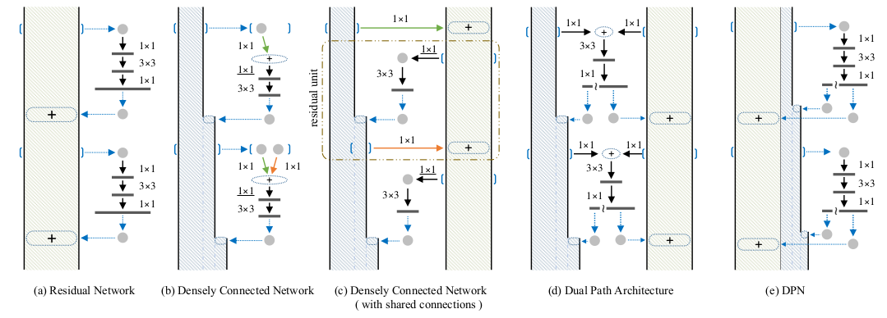

# Dual Path Network (DPN)
> For more details, please refer to: [Dual Path Network](https://arxiv.org/abs/1707.01629)

## Introduction

<div align=center>


</div>

The above figure shows the model architecture of ResNet, DenseNet, the combination of ResNet and DenseNet. ResNet could reuse the features while DenseNet could introduce new features. Dual Path Network enjoys both benefits by combining them together. In every stage, the features with static channels and the features with inceasing channels are concatenated. Finally, Dual Path Network could achieve better model performance than ResNet and DenseNet on [ImageNet-1K dataset](https://www.image-net.org/download.php).

## Results

<div align=center>

| Model           | Context   |  Top-1 (%)  | Top-5 (%)  |  Params (M)    | Train T. | Infer T. |  Download | Config | Log |
|-----------------|-----------|-------|-------|------------|-------|--------|---|--------|--------------|
| DPN-92 | D910x8-G | -     | -     | -       | -s/epoch | -ms/step | [model]() | [cfg]() | [log]() |
| DPN-98 | D910x8-G | -     | -     | -      | -s/epoch | -ms/step | [model]() | [cfg]() | [log]() |
| DPN-131 | D910x8-G | - | - | - | -s/epoch | -ms/step | [model]() | [cfg]() | [log]() |

</div>

#### Notes

- All models are trained on ImageNet-1K training set and the top-1 accuracy is reported on the validatoin set.
- Context: GPU_TYPE x pieces - G/F, G - graph mode, F - pynative mode with ms function.  

## Quick Start
<details>
<summary>Preparation</summary>

#### Installation
Please refer to the [installation instruction](https://github.com/mindspore-ecosystem/mindcv#installation) in MindCV.

#### Dataset Preparation
Please download the [ImageNet-1K](https://www.image-net.org/download.php) dataset for model training and validation.
</details>

<details>
<summary>Training</summary>

- **Hyper-parameters.** The hyper-parameter configurations for producing the reported results are stored in the yaml files in `mindcv/configs/dpn` folder. For example, to train with one of these configurations, you can run:

  ```shell
  # train dpn-131 on 8 GPUs
  mpirun -n 8 python train.py --config path/to/dpn/yaml/file --data_dir /path/to/imagenet
  ```

  Note that the number of GPUs/Ascends and batch size will influence the training results. To reproduce the training result at most, it is recommended to use the **same number of GPUs/Ascends** with the same batch size.

Detailed adjustable parameters and their default value can be seen in [config.py](../../config.py).
</details>

<details>
<summary>Validation</summary>

- To validate the model, you can use `validate.py`. Here is an example for dpn-131 to verify the accuracy of your
  training.

  ```shell
  python validate.py --config path/to/dpn/yaml/file --data_dir /path/to/imagenet --ckpt_path /path/to/dpn/file.ckpt
  ```
</details>

<details>
<summary>Deployment (optional)</summary>

Please refer to the deployment tutorial in MindCV.
</details>


