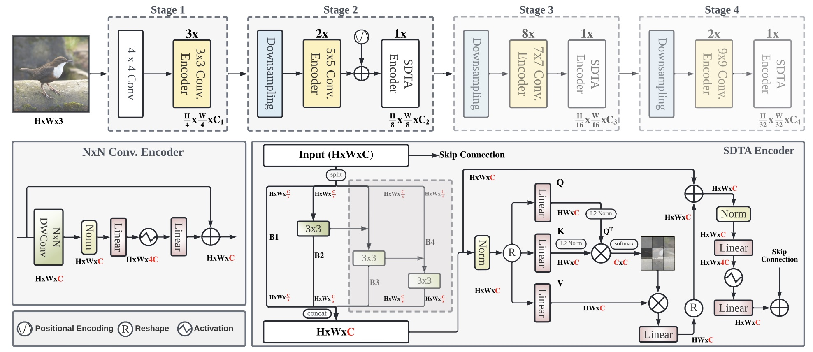

# EdgeNeXt

> [EdgeNeXt: Efficiently Amalgamated CNN-Transformer Architecture for Mobile Vision Applications](https://arxiv.org/abs/2206.10589)

## 模型简介

***

在达到不断增长的准确度的追求中，通常开发了大型且复杂的神经网络。这样的模型要求很高的计算资源并因此不能部署到边缘设备上。由于在许多应用领域的有效性，构建资源高效的通用网络引起了人们的极大兴趣。在这项工作中，我们尽力有效结合CNN和Transformer模型的优势并提出一种新的高效混合结构EdgeNeXt。具体说，在EdgeNeXt中，我们引入了分裂深度转置注意（SDTA）编码器，它能够分离输入张量为多个通道组，并利用深度卷积和自注意力跨通道维度显式增加感受野并编码多尺度特征。



## 性能指标

***

| Model           | Context   |  Top-1 (%)  | Top-5 (%)  |  Params (M)    | Train T. | Infer T. |  Download | Config | Log |
|-----------------|-----------|-------|-------|------------|-------|--------|---|--------|--------------|
| edgenext_small | D910x8-G | 79.146     | 94.394     | 5.59M       | 518s/epoch |  | [model]() | [cfg]() | [log]() |

#### 备注

- 以上模型均在ImageNet-1K数据集上训练和验证。
- Context: GPU_TYPE x pieces - G/F, G - graph mode, F - pynative mode with ms function.  

## 示例

### 训练

- 下面是使用预设的yaml配置文件启动训练的示例.

> [configs文件夹](../../configs)中列出了mindcv套件所包含的模型的各个规格的yaml配置文件(在ImageNet数据集上训练和验证的配置)。
  ```shell
  # train edgenext_small on 8 Ascends
  export CUDA_VISIBLE_DEVICES=0,1,2,3,4,5,6,7
  mpirun -n 8 python train.py -c configs/edgenext/edgenext_small_ascend.yaml --data_dir /path/to/imagenet_dir
  ```
  
  详细的可调参数及其默认值可以在[config.py](../../config.py)中查看。

### 验证

- 下面是使用`validate.py`文件验证edgenext_small的预训练模型的精度的示例。

  ```shell
  python validate.py --model=edgenext_small --data_dir=imagenet_dir --val_split=val --ckpt_path
  ```
