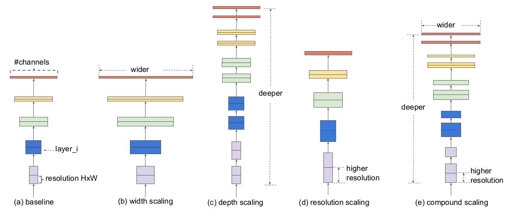

# EfficientNet
> 想了解更多细节，请参考： [EfficientNet: Rethinking Model Scaling for Convolutional Neural Networks](https://arxiv.org/abs/1905.11946)

## 模型简介

<div align=center>


</div>

上图展现了从三个维度扩展模型的方法--宽度，深度，分辨率还有三种方法混合来扩大模型。只选用一种方法来增大模型会让模型达到次优解。然而，如果三种方法同时应用到扩大模型中，模型的最优解更容易被找到。通过神经网络搜索的方法，EfficientNet找到了最好的一组宽度系数，深度系数和分辨率系数的参数。EfficientNet可以在 [ImageNet-1K dataset](https://www.image-net.org/download.php)上实现更好的模型表现。

## 性能指标

<div align=center>

| Model           | Context   |  Top-1 (%)  | Top-5 (%)  |  Params (M)    | Train T. | Infer T. |  Download | Config | Log |
|-----------------|-----------|-------|-------|------------|-------|--------|---|--------|--------------|
| Efficient-B0 | D910x8-G | -     | -     | -       | -s/epoch | -ms/step | [model]() | [cfg]() | [log]() |
| Efficient-B1 | D910x8-G | -     | -     | -       | -s/epoch | -ms/step | [model]() | [cfg]() | [log]() |
| Efficient-B2 | D910x8-G | -     | -     | -       | -s/epoch | -ms/step | [model]() | [cfg]() | [log]() |
| Efficient-B3 | D910x8-G | -     | -     | -       | -s/epoch | -ms/step | [model]() | [cfg]() | [log]() |
| Efficient-B4 | D910x8-G | -     | -     | -       | -s/epoch | -ms/step | [model]() | [cfg]() | [log]() |
| Efficient-B5 | D910x8-G | -     | -     | -       | -s/epoch | -ms/step | [model]() | [cfg]() | [log]() |
| Efficient-B6 | D910x8-G | -     | -     | -       | -s/epoch | -ms/step | [model]() | [cfg]() | [log]() |
| Efficient-B7 | D910x8-G | -     | -     | -       | -s/epoch | -ms/step | [model]() | [cfg]() | [log]() |
</div>

#### 备注

- 所有的模型均在ImageNet-1K上进行训练，并且top-1 accuracy和top-5 accuracy被报告。
- Context: GPU_TYPE x pieces - G/F, G - graph mode, F - pynative mode with ms function.  

## 快速开始

<details>
<summary>准备</summary>

#### 安装
请参考mindcv的[安装指示](https://github.com/mindspore-ecosystem/mindcv#installation)。

#### 数据集准备
请下载[ImageNet-1K](htps://www.image-net.org/download.php)数据集用于训练和验证。
</details>

<details>
<summary>训练</summary>

- **超参数.** 可复现训练结果的配置设置存放在 `mindcv/configs/efficientnet`文件夹。例如，为了按照某个配置进行训练，你可以运行:

  ```shell
  # train EfficientNet-B0 on 8 GPUs
  mpirun -n 8 python train.py --config path/to/efficientnet/yaml/file --data_dir /path/to/imagenet
  ```

  注意GPU或者昇腾芯片的数量以及batch size都会影响复现结果。为了最大程度的复现结果，推荐采用相同显卡数量和相同batch size进行训练。

详细的参数可以参考[config.py](../../config.py)。
</details>

<details>
<summary>验证</summary>

- 为了验证模型，你可以使用`validate.py`。 这里有一个例子来验证Efficient-B0模型的精准度。

  ```shell
  python validate.py --config path/to/efficientnet/yaml/file --data_dir /path/to/imagenet --ckpt_path /path/to/efficientnet/file.ckpt
  ```

</details>


<details>
<summary>部署（可选）</summary>

请参考mindcv中的部署教程。 
</details>


