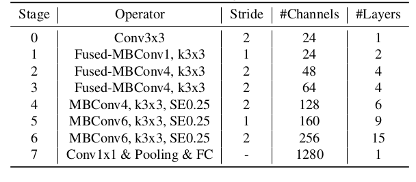

# EfficientNetV2
> For more details, please refer to: [EfficientNetV2: Smaller Models and Faster Training](https://arxiv.org/abs/2104.00298)

## Introduction

<div align=center>


</div>

The above figure shows the model architecture of EfficientV2-S. The key motivation of this method is that for every stage, it uses different configurations to make the model reach to best performance. Besides that, Fused mobilenet block is used to keep more features and improve model performance. EfficientNetV2 could achieve better model performance on [ImageNet-1K dataset](https://www.image-net.org/download.php) compared with EfficientNet.

## Results

<div align=center>

| Model           | Context   |  Top-1 (%)  | Top-5 (%)  |  Params (M)    | Train T. | Infer T. |  Download | Config | Log |
|-----------------|-----------|-------|-------|------------|-------|--------|---|--------|--------------|
| EfficientV2-S | D910x8-G | -     | -     | -       | -s/epoch | -ms/step | [model]() | [cfg]() | [log]() |
| EfficientV2-M | D910x8-G | -     | -     | -       | -s/epoch | -ms/step | [model]() | [cfg]() | [log]() |
| EfficientV2-L | D910x8-G | -     | -     | -       | -s/epoch | -ms/step | [model]() | [cfg]() | [log]() |
</div>

#### Notes

- All models are trained on ImageNet-1K training set and the top-1 accuracy is reported on the validatoin set.
- Context: GPU_TYPE x pieces - G/F, G - graph mode, F - pynative mode with ms function.  

## Quick Start
<details>
<summary>Preparation</summary>

#### Installation
Please refer to the [installation instruction](https://github.com/mindspore-ecosystem/mindcv#installation) in MindCV.

#### Dataset Preparation
Please download the [ImageNet-1K](https://www.image-net.org/download.php) dataset for model training and validation.
</details>

<details>
<summary>Training</summary>

- **Hyper-parameters.** The hyper-parameter configurations for producing the reported results are stored in the yaml files in `mindcv/configs/efficientnetv2` folder. For example, to train with one of these configurations, you can run:

  ```shell
  # train EfficientNetV2-S on 8 GPUs
  mpirun -n 8 python train.py --config path/to/efficientnetv2/yaml/file --data_dir /path/to/imagenet
  ```

  Note that the number of GPUs/Ascends and batch size will influence the training results. To reproduce the training result at most, it is recommended to use the **same number of GPUs/Ascends** with the same batch size.

Detailed adjustable parameters and their default value can be seen in [config.py](../../config.py).
</details>

<details>
<summary>Validation</summary>

- To validate the model, you can use `validate.py`. Here is an example for EfficientNetV2-S to verify the accuracy of your
  training.

  ```shell
  python validate.py --config path/to/efficientnetv2/yaml/file --data_dir /path/to/imagenet --ckpt_path /path/to/efficientnetv2/file.ckpt
  ```
</details>

<details>
<summary>Deployment (optional)</summary>

Please refer to the deployment tutorial in MindCV.
</details>


