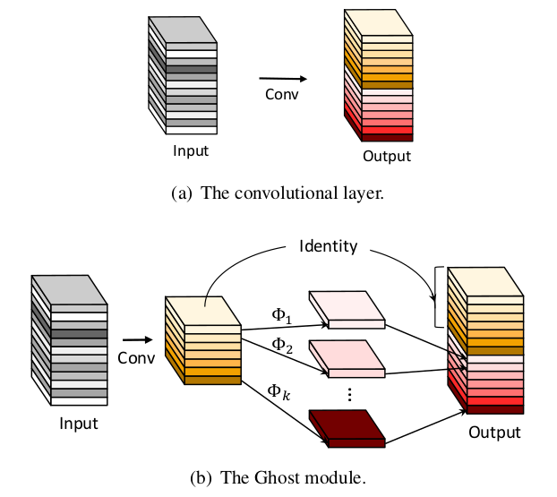

# GhostNet
> For more details, please refer to: [GhostNet: More Features from Cheap Operations](https://arxiv.org/abs/1911.11907)

## Introduction

<div align=center>


</div>

The above figure shows the key idea of GhostNet. In mediate layers of ResNet, some features could be transformed from features of the same layers by linear computing. Therefore, in Ghost module, some convolution operations are replaced by linear operations to reduce computation cost. GhostNet could achieve better model performance with smaller model size and fewer computation cost on [ImageNet-1K dataset](https://www.image-net.org/download.php) compared with previous methods.

## Results

| Model           | Context   |  Top-1 (%)  | Top-5 (%)  |  Params (M)    | Train T. | Infer T. |  Download | Config | Log |
|-----------------|-----------|-------|-------|------------|-------|--------|---|--------|--------------|
| Ghost-ResNet-50 | D910x8-G | -     | -     | -       | -s/epoch | -ms/step | [model]() | [cfg]() | [log]() |


#### Notes

- All models are trained on ImageNet-1K training set and the top-1 accuracy is reported on the validatoin set.
- Context: GPU_TYPE x pieces - G/F, G - graph mode, F - pynative mode with ms function.  

## Quick Start
<details>
<summary>Preparation</summary>

#### Installation
Please refer to the [installation instruction](https://github.com/mindspore-ecosystem/mindcv#installation) in MindCV.

#### Dataset Preparation
Please download the [ImageNet-1K](https://www.image-net.org/download.php) dataset for model training and validation.
</details>

<details>
<summary>Training</summary>

- **Hyper-parameters.** The hyper-parameter configurations for producing the reported results are stored in the yaml files in `mindcv/configs/ghostnet` folder. For example, to train with one of these configurations, you can run:

  ```shell
  # train Ghost-ResNet-50 on 8 GPUs
  mpirun -n 8 python train.py --config path/to/ghostnet/yaml/file --data_dir /path/to/imagenet
  ```

  Note that the number of GPUs/Ascends and batch size will influence the training results. To reproduce the training result at most, it is recommended to use the **same number of GPUs/Ascends** with the same batch size.

Detailed adjustable parameters and their default value can be seen in [config.py](../../config.py).
</details>

<details>
<summary>Validation</summary>

- To validate the model, you can use `validate.py`. Here is an example for Ghost-ResNet-50 to verify the accuracy of your
  training.

  ```shell
  python validate.py --config path/to/ghostnet/yaml/file --data_dir /path/to/imagenet --ckpt_path /path/to/ghostnet/file.ckpt
  ```
</details>

<details>
<summary>Deployment (optional)</summary>

Please refer to the deployment tutorial in MindCV.
</details>


