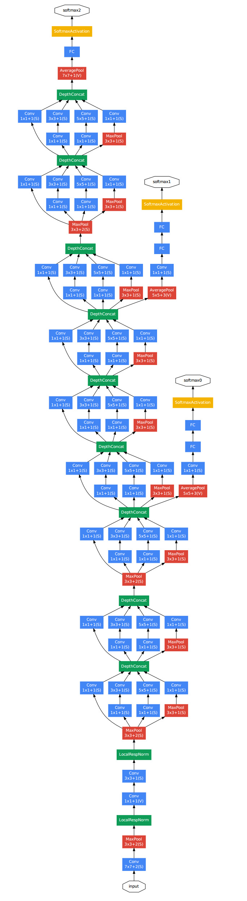

# GoogleNet

***
> [GoogleNet: Going Deeper with Convolutions](https://arxiv.org/abs/1409.4842)

## Introduction

***
GoogLeNet is a new deep learning structure proposed by Christian Szegedy in 2014. Prior to this, AlexNet, VGG and other
structures achieved better training effects by increasing the depth (number of layers) of the network, but the increase
in the number of layers It will bring many negative effects, such as overfit, gradient disappearance, gradient
explosion, etc. The proposal of inception improves the training results from another perspective: it can use computing
resources more efficiently, and can extract more features under the same amount of computing, thereby improving the
training results.



## Benchmark

***

|        |           |           |           |    Pynative     |  Pynative  |     Graph      |   Graph    |           |            |
| :----: | --------- | :-------: | :-------: | :-------------: | :--------: | :------------: | :--------: | :-------: | :--------: |
|        | Model     | Top-1 (%) | Top-5 (%) | train (s/epoch) | Infer (ms) | train(s/epoch) | Infer (ms) | Download  |   Config   |
|  GPU   | googlenet |           |           |     260.898     |            |    260.434     |            | [model]() | [config]() |
| Ascend | googlenet |           |           |                 |            |                |            |           |            |

## Examples

***

### Train

- The [yaml config files](../../configs) that yield competitive results on ImageNet for different models are listed in
  the `configs` folder. To trigger training using preset yaml config.

  ```shell
  comming soon
  ```


- Here is the example for finetuning a pretrained GoogleNet on CIFAR10 dataset using Momentum optimizer.

  ```shell
  python train.py --model=googlenet --pretrained --opt=momentum --lr=0.001 dataset=cifar10 --num_classes=10 --dataset_download
  ```

Detailed adjustable parameters and their default value can be seen in [config.py](../../config.py).

### Eval

- To validate the model, you can use `validate.py`. Here is an example to verify the accuracy of pretrained weights.

  ```shell
  python validate.py --model=googlenet --dataset=imagenet --val_split=val --pretrained
  ```

- To validate the model, you can use `validate.py`. Here is an example to verify the accuracy of your training.

  ```shell
  python validate.py --model=googlenet --dataset=imagenet --val_split=val --ckpt_path='./ckpt/googlenet-best.ckpt'
  ```

