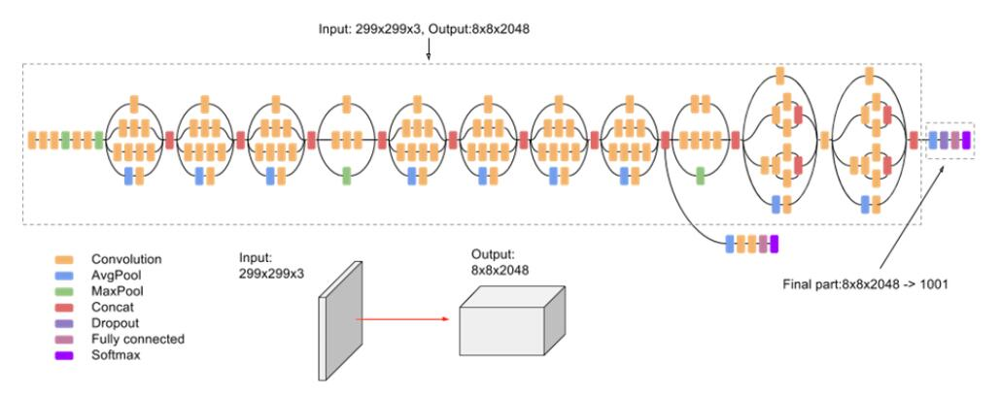

# InceptionV3

***

> [InceptionV3: Rethinking the Inception Architecture for Computer Vision](https://arxiv.org/pdf/1512.00567.pdf)

## 模型简介

***

InceptionV3是GoogleNet的升级版。V3最重要的改进之一就是分解卷积，将7x7的卷积核分解成两个一维卷积（1x7, 7x1），3x3的卷积核分解成（1x3,
3x1）。这样做的好处是既可以加速计算（多余的算力可以用来加深网络），又可以通过将1个卷积核拆分成2个两个卷积核，进一步增加了网络深度，增加了网络的非线性。InceptionV3模型还有一些其他值得注意的改进是，网络的输入的分辨率从224x224变成了299x299，同时35x35/17x17/8x8模块的设计也更加合理，在不增加计算量的情况下，规避特征表达瓶颈。此外，InceptionV3还加入了批标准化，使得模型收敛更快，起到了局部正则化的作用，有效减少了过拟合。


## 性能指标

***

|        |              |           |           |    Pynative     |  Pynative  |     Graph      |   Graph    |           |            |
| :----: | ------------ | :-------: | :-------: | :-------------: | :--------: | :------------: | :--------: | :-------: | :--------: |
|        | Model        | Top-1 (%) | Top-5 (%) | train (s/epoch) | Infer (ms) | train(s/epoch) | Infer (ms) | Download  |   Config   |
|  GPU   | inception_v3 |           |           |    1145.248     |            |    1063.01     |            | [model]() | [config]() |
| Ascend | inception_v3 |           |           |                 |            |                |            |           |            |

## 示例

***

### 训练

- 下面是使用预设的yaml配置文件启动训练的示例.

> [configs文件夹](../../configs)中列出了mindcv套件所包含的模型的各个规格的yaml配置文件(在ImageNet数据集上训练和验证的配置)。

  ```shell
  comming soon
  ```

- 下面是使用在ImageNet上预训练的InceptionV3模型和Momentum优化器在CIFAR10数据集上进行微调的示例。

  ```shell
  python train.py --model=inception_v3 --pretrained --opt=momentum --lr=0.001 dataset=cifar10 --num_classes=10 --dataset_download
  ```

详细的可调参数及其默认值可以在[config.py](../../config.py)中查看。

### 验证

- 下面是使用`validate.py`文件验证InceptionV3的预训练模型的精度的示例。

  ```shell
  python validate.py --model=inception_v3 --dataset=imagenet --val_split=val --pretrained
  ```

- 下面是使用`validate.py`文件验证InceptionV3的自定义参数文件的精度的示例。

  ```shell
  python validate.py --model=inception_v3 --dataset=imagenet --val_split=val --ckpt_path='./ckpt/inception_v3-best.ckpt'
  ```
