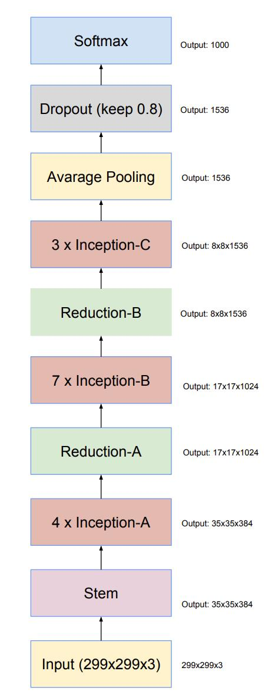

# InceptionV4

***
> [InceptionV4: Inception-v4, Inception-ResNet and the Impact of Residual Connections on Learning](https://arxiv.org/pdf/1602.07261.pdf)

## 模型简介

***

在开发InceptionV4模型的过程中，研究人员探究了残差网络结合Inception模块是否可以增强模型的性能。结果显示该结构可以大大加速训练，性能得到了极大的提升。
通过该研究，研究人员提出了Inception-ResNetV2模型，同时还基于该模型，设计了性能更好的InceptionV4模型。



## 性能指标

***

|        |              |           |           |    Pynative     |  Pynative  |     Graph      |   Graph    |           |            |
| :----: | ------------ | :-------: | :-------: | :-------------: | :--------: | :------------: | :--------: | :-------: | :--------: |
|        | Model        | Top-1 (%) | Top-5 (%) | train (s/epoch) | Infer (ms) | train(s/epoch) | Infer (ms) | Download  |   Config   |
|  GPU   | inception_v4 |           |           |    1702.063     |            |    1895.667    |            | [model]() | [config]() |
| Ascend | inception_v4 |           |           |                 |            |                |            |           |            |

## 示例

***

### 训练

- 下面是使用预设的yaml配置文件启动训练的示例.

> [configs文件夹](../../configs)中列出了mindcv套件所包含的模型的各个规格的yaml配置文件(在ImageNet数据集上训练和验证的配置)。

  ```shell
  comming soon
  ```

- 下面是使用在ImageNet上预训练的InceptionV3模型和Momentum优化器在CIFAR10数据集上进行微调的示例。

  ```shell
  python train.py --model=inception_v4 --pretrained --opt=momentum --lr=0.001 dataset=cifar10 --num_classes=10 --dataset_download
  ```

Detailed adjustable parameters and their default value can be seen in [config.py](../../config.py).

### 验证

- To validate the model, you can use `validate.py`. Here is an example to verify the accuracy of pretrained weights.

  ```shell
  python validate.py --model=inception_v4 --dataset=imagenet --val_split=val --pretrained
  ```

- To validate the model, you can use `validate.py`. Here is an example to verify the accuracy of your training.

  ```shell
  python validate.py --model=inception_v4 --dataset=imagenet --val_split=val --ckpt_path='./ckpt/inception_v4-best.ckpt'
  ```
