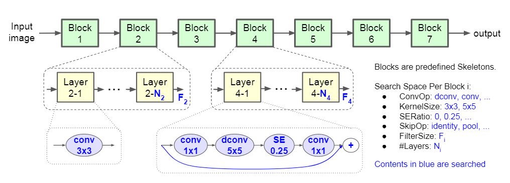

# MnasNet
> [MnasNet: Platform-Aware Neural Architecture Search for Mobile](https://arxiv.org/abs/1807.11626)

## Introduction
***

Designing convolutional neural networks (CNN) for mobile devices is challenging because mobile models need to be small and fast, yet still accurate. Although significant efforts have been dedicated to design and improve mobile CNNs on all dimensions, it is very difficult to manually balance these trade-offs when there are so many architectural possibilities to consider. In this paper, we propose an automated mobile neural architecture search (MNAS) approach, which explicitly incorporate model latency into the main objective so that the search can identify a model that achieves a good trade-off between accuracy and latency. Unlike previous work, where latency is considered via another, often inaccurate proxy (e.g., FLOPS), our approach directly measures real-world inference latency by executing the model on mobile phones. To further strike the right balance between flexibility and search space size, we propose a novel factorized hierarchical search space that encourages layer diversity throughout the network.



## Results
***

| Model           | Context   |  Top-1 (%)  | Top-5 (%)  |  Params (M)    | Train T. | Infer T. |  Download | Config | Log |
|-----------------|-----------|-------|-------|:----------:|-------|--------|---|--------|--------------|
| MnasNet-B1-0_75 |  D910x8-G  | 71.81 | 90.53 | 3.20 |  96s/epoch  |  | [model]() | [cfg]()    | [log]() |
| MnasNet-B1-1_0 |  D910x8-G  | 74.28 | 91.70 | 4.42 | 96s/epoch | | [model]() | [cfg]()    | [log]() |
| MnasNet-B1-1_4 | D910x8-G | 76.01 | 92.83 | 7.16 | 121s/epoch | | [model]() | [cfg]() | [log]() |

#### Notes
- All models are trained on ImageNet-1K training set and the top-1 accuracy is reported on the validatoin set.
- Context: GPU_TYPE x pieces - G/F, G - graph mode, F - pynative mode with ms function.  

## Quick Start
***
### Preparation

#### Installation
Please refer to the [installation instruction](https://github.com/mindspore-ecosystem/mindcv#installation) in MindCV.

#### Dataset Preparation
Please download the [ImageNet-1K](https://www.image-net.org/download.php) dataset for model training and validation.

### Training

- **Hyper-parameters.** The hyper-parameter configurations for producing the reported results are stored in the yaml files in `mindcv/configs/mnasnet` folder. For example, to train with one of these configurations, you can run:

  ```shell
  export CUDA_VISIBLE_DEVICES=0,1,2,3,4,5,6,7
  mpirun -n 8 python train.py -c configs/mnasnet/mnasnet0.75_gpu.yaml --data_dir /path/to/imagenet
  ```
  
  Note that the number of GPUs/Ascends and batch size will influence the training results. To reproduce the training result at most, it is recommended to use the **same number of GPUs/Ascends** with the same batch size.

Detailed adjustable parameters and their default value can be seen in [config.py](../../config.py).

### Validation

- To validate the trained model, you can use `validate.py`. Here is an example for mnasnet0_75 to verify the accuracy of pretrained weights.
  
  ```shell
  python validate.py 
  -c configs/mnasnet/mnasnet0.75_ascend.yaml 
  --data_dir=/path/to/imagenet 
  --ckpt_path=/path/to/ckpt
  ```
  
- To validate the model, you can use `validate.py`. Here is an example for mnasnet0_75 to verify the accuracy of your training.
  
  ```shell
  python validate.py 
  -c configs/mnasnet/mnasnet0.75_ascend.yaml 
  --data_dir=/path/to/imagenet 
  --ckpt_path=/path/to/ckpt
  ```

### Deployment (optional)

Please refer to the deployment tutorial in MindCV.


