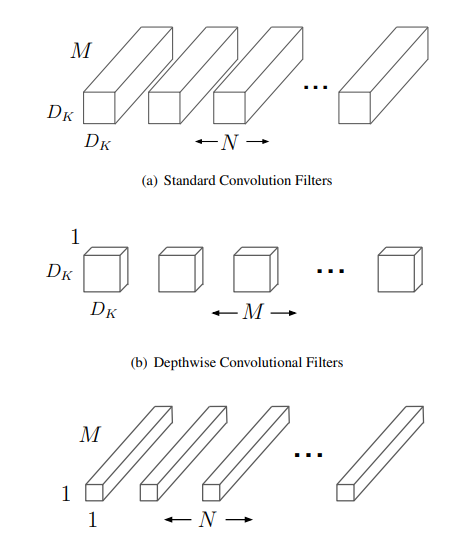

# MobileNetV1

***
> [MobileNetV1: Efficient Convolutional Neural Networks for Mobile Vision Applications](https://arxiv.org/pdf/1704.04861.pdf)

## Introduction

***
Compared with the traditional convolutional neural network, MobileNetV1's parameters and the amount of computation are
greatly reduced on the premise that the accuracy rate is slightly reduced.
(Compared to VGG16, the accuracy rate is reduced by 0.9%, but the model parameters are only 1/32 of VGG). The model is
based on a streamlined architecture that uses depthwise separable convolutions to build lightweight deep neural
networks.
At the same time, two simple global hyperparameters are introduced, which can effectively trade off latency and
accuracy.



## Results
***

| Model           | Context   |  Top-1 (%)  | Top-5 (%)  |  Params (M)    | Train T. | Infer T. |  Download | Config | Log |
|-----------------|-----------|-------------|------------|----------------|----------|----------|-----------|--------|--------------|
| MobileNet_v1_025 | D910x8-G | 54.64       | 78.29      | 0.47           | 113s/epoch |        | [model]() | [cfg]() | [log]() |
| MobileNet_v1_050 | D910x8-G | 66.39       | 86.71      | 1.34           | 120s/epoch |        | [model]() | [cfg]() | [log]() |
| MobileNet_v1_075 | D910x8-G | 70.66       | 89.49      | 2.60           | 128s/epoch |        | [model]() | [cfg]() | [log]() |
| MobileNet_v1_100 | D910x8-G | 71.83       | 90.26      | 4.25           | 130s/epoch |        | [model]() | [cfg]() | [log]() |

#### Notes

- All models are trained on ImageNet-1K training set and the top-1 accuracy is reported on the validatoin set.
- Context: GPU_TYPE x pieces - G/F, G - graph mode, F - pynative mode with ms function.  

## Quick Start
***
### Preparation

#### Installation
Please refer to the [installation instruction](https://github.com/mindspore-ecosystem/mindcv#installation) in MindCV.

#### Dataset Preparation
Please download the [ImageNet-1K](https://www.image-net.org/download.php) dataset for model training and validation.

### Training

- **Hyper-parameters.** The hyper-parameter configurations for producing the reported results are stored in the yaml files in `mindcv/configs/mobilenetv1` folder. For example, to train with one of these configurations, you can run:

  ```shell
  # train densenet121 on 8 GPUs
  export CUDA_VISIBLE_DEVICES=0,1,2,3,4,5,6,7
  mpirun -n 8 python train.py -c configs/mobilenetv1/mobilenetv1_100_gpu.yaml --data_dir /path/to/imagenet
  ```
  
  Note that the number of GPUs/Ascends and batch size will influence the training results. To reproduce the training result at most, it is recommended to use the **same number of GPUs/Ascneds** with the same batch size.

- **Finetuning.** Here is an example for finetuning a pretrained mobilenet_050 on CIFAR10 dataset using Momentum optimizer.

  ```shell
  python train.py --model=mobilenet_v1_100_224 --pretrained --opt=momentum --lr=0.001 dataset=cifar10 --num_classes=10 --dataset_download
  ```

Detailed adjustable parameters and their default value can be seen in [config.py](../../config.py).

### Validation

- To validate the trained model, you can use `validate.py`. Here is an example for mobilenet_100 to verify the accuracy of
  pretrained weights.

  ```shell
  python validate.py --model=mobilenet_v1_100_224 --dataset=imagenet --val_split=val --pretrained
  ```

- To validate the model, you can use `validate.py`. Here is an example for mobilenetv1_100 to verify the accuracy of your
  training.

  ```shell
  python validate.py --model=mobilenet_v1_100_224 --dataset=imagenet --val_split=val --ckpt_path='./ckpt/mobilenet_v1_100_224-200_2502.ckpt'
  ```

### Deployment (optional)

Please refer to the deployment tutorial in MindCV.
