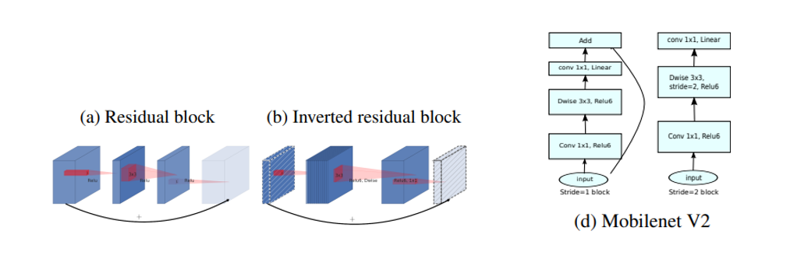

# MobileNetV2

***
> [MobileNetV2: Inverted Residuals and Linear Bottlenecks](https://arxiv.org/pdf/1801.04381.pdf)

## Introduction

***

The model is a new neural network architecture that is specifically tailored for mobile and resource-constrained environments.
This network pushes the state of the art for mobile custom computer vision models, significantly reducing the amount of operations and memory required while maintaining the same accuracy.

The main innovation of the model is the proposal of a new layer module: The Inverted Residual with Linear Bottleneck. The module takes as input a low-dimensional compressed representation that is first extended to high-dimensionality and then filtered with lightweight depth convolution.
Linear convolution is then used to project the features back to the low-dimensional representation.

## Results
model is under testing, comming soon
