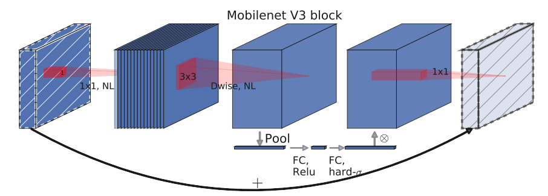

# MobileNetV3

***
> [Searching for MobileNetV3](https://arxiv.org/pdf/1905.02244v5.pdf)

## 模型简介

***
MobileNet v3发表于2019年，该v3版本结合了v1的深度可分离卷积、v2的Inverted Residuals和Linear Bottleneck、SE模块，利用NAS（神经结构搜索）来搜索网络的配置和参数。MobileNetV3 首先使用 MnasNet 进行粗略结构的搜索，然后使用强化学习从一组离散的选择中选择最优配置。之后，MobileNetV3 再使用 NetAdapt 对体系结构进行微调，这体现了 NetAdapt 的补充功能，它能够以较小的降幅对未充分利用的激活通道进行调整。

mobilenet-v3提供了两个版本，分别为mobilenet-v3 large 以及mobilenet-v3 small，分别适用于对资源不同要求的情况，论文中提到，mobilenet-v3 small在imagenet分类任务上，较mobilenet-v2，精度提高了大约3.2%，时间却减少了15%，mobilenet-v3 large在imagenet分类任务上，较mobilenet-v2，精度提高了大约4.6%，时间减少了5%，mobilenet-v3 large 与v2相比，在COCO上达到相同的精度，速度快了25%，同时在分割算法上也有一定的提高。



## 性能指标

***

| Model                 | Context  | Top-1 (%) | Top-5 (%) | Params (M) | Train T.   | Infer T. | Download  | Config  | Log     |
| --------------------- | -------- | --------- | --------- | ---------- | ---------- | -------- | --------- | ------- | ------- |
| MobileNetV3_large_100 | D910x8-G | 75.14     | 92.33     | 5.51       | 225s/epoch |          | [model]() | [cfg]() | [log]() |
| MobileNetV3_small_100 | D910x8-G | 67.34     | 87.49     | 2.55       | 118s/epoch |          | [model]() | [cfg]() | [log]() |

#### 备注

- All models are trained on ImageNet-1K training set and the top-1 accuracy is reported on the validatoin set.
- Context: GPU_TYPE x pieces - G/F, G - graph mode, F - pynative mode with ms function.  

## 示例

- 以上模型均在ImageNet-1K数据集上训练和验证。
- Context: GPU_TYPE x pieces - G/F, G - graph mode, F - pynative mode with ms function.  

***

### 训练

- 下面是使用预设的yaml配置文件启动训练的示例.

> [configs文件夹](../../configs)中列出了mindcv套件所包含的模型的各个规格的yaml配置文件(在ImageNet数据集上训练和验证的配置)。

  ```shell
cd mindcv/scripts
bash run_distribute_train_ascend.sh ./hccl_8p_01234567_123.60.231.9.json /tmp/dataset/imagenet ../configs/mobilenetv3/v3_large_Ascend.yaml
  ```

详细的可调参数及其默认值可以在[config.py](../../config.py)中查看。

### 验证

- 下面是使用`validate.py`文件验证densenet121的自定义参数文件的精度的示例。

  ```shell
  python validate.py -c configs/mobilenetv3/v3_large_Ascend.yaml
  ```
