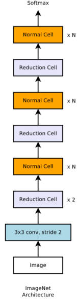
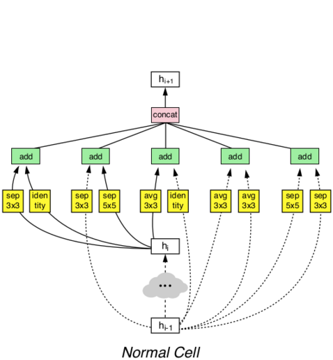
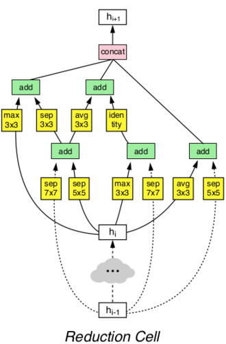

# NASNet
> For more details, please refer to: [Learning Transferable Architectures for Scalable Image Recognition](https://arxiv.org/abs/1707.07012)

## Introduction

<div align=center>


</div>

The ket idea of NASNet is that by using neural architecture search, the model with best model performance could be found. The search pool contains convolutional kernels with different kernel size, pooling operations, concat or add operations. The left figure shows the model architecture after neural architecture search, the middle figure shows the architecture of normal cell, and the right figure shows the architecture of reduction cell. NASNet could achieve better model performance on [ImageNet-1K dataset](https://www.image-net.org/download.php) compared with previous methods.

## Results

| Model           | Context   |  Top-1 (%)  | Top-5 (%)  |  Params (M)    | Train T. | Infer T. |  Download | Config | Log |
|-----------------|-----------|-------|-------|------------|-------|--------|---|--------|--------------|
| NASNet-A | D910x8-G | -     | -     | -       | -s/epoch | -ms/step | [model]() | [cfg]() | [log]() |
| NASNet-B | D910x8-G | -     | -     | -       | -s/epoch | -ms/step | [model]() | [cfg]() | [log]() |
| NASNet-C | D910x8-G | -     | -     | -       | -s/epoch | -ms/step | [model]() | [cfg]() | [log]() |


#### Notes

- All models are trained on ImageNet-1K training set and the top-1 accuracy is reported on the validatoin set.
- Context: GPU_TYPE x pieces - G/F, G - graph mode, F - pynative mode with ms function.  

## Quick Start
<details>
<summary>Preparation</summary>

#### Installation
Please refer to the [installation instruction](https://github.com/mindspore-ecosystem/mindcv#installation) in MindCV.

#### Dataset Preparation
Please download the [ImageNet-1K](https://www.image-net.org/download.php) dataset for model training and validation.
</details>

<details>
<summary>Training</summary>

- **Hyper-parameters.** The hyper-parameter configurations for producing the reported results are stored in the yaml files in `mindcv/configs/nasnet` folder. For example, to train with one of these configurations, you can run:

  ```shell
  # train NASNet-A on 8 GPUs
  mpirun -n 8 python train.py --config path/to/nasnet/yaml/file --data_dir /path/to/imagenet
  ```

  Note that the number of GPUs/Ascends and batch size will influence the training results. To reproduce the training result at most, it is recommended to use the **same number of GPUs/Ascends** with the same batch size.

Detailed adjustable parameters and their default value can be seen in [config.py](../../config.py).
</details>

<details>
<summary>Validation</summary>

- To validate the model, you can use `validate.py`. Here is an example for NASNet-A to verify the accuracy of your training.

  ```shell
  python validate.py --config path/to/nasnet/yaml/file --data_dir /path/to/imagenet --ckpt_path /path/to/nasnet/file.ckpt
  ```
</details>

<details>
<summary>Deployment (optional)</summary>

Please refer to the deployment tutorial in MindCV.
</details>


