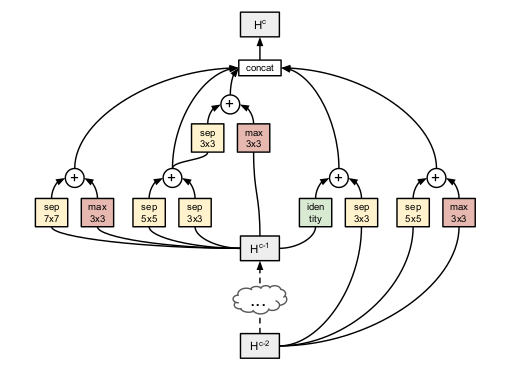
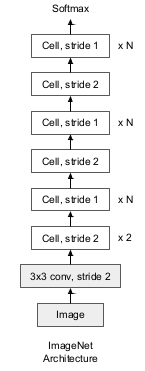

# PNASNet (Progressive Neural Architecture Search Network)
> 想了解更多细节，请参考： [Progressive Neural Architecture Search](https://arxiv.org/abs/1712.00559)

## 模型简介

<div align=center>


</div>

PNASNet的核心思想是为了减小搜索复杂度的sequential model-based optimation方法。除此之外，搜索池中的一些操作被舍弃从而减小了搜索空间。还有，一个代理函数被用来预测模型精度而不是训练所有模型得到精度。左图展示了搜索之后最好的模块结构。右图展示了PNASNet的模型结构。相比于NASNet，PNASNet可以以更快的搜索速度在 [ImageNet-1K dataset](https://www.image-net.org/download.php)上实现更好的模型表现。

## 性能指标

<div align=center>

| Model           | Context   |  Top-1 (%)  | Top-5 (%)  |  Params (M)    | Train T. | Infer T. |  Download | Config | Log |
|-----------------|-----------|-------|-------|------------|-------|--------|---|--------|--------------|
| PNASNet-5 | D910x8-G | -     | -     | -       | -s/epoch | -ms/step | [model]() | [cfg]() | [log]() |
</div>


#### 备注

- 所有的模型均在ImageNet-1K上进行训练，并且top-1 accuracy和top-5 accuracy被报告。
- Context: GPU_TYPE x pieces - G/F, G - graph mode, F - pynative mode with ms function.  

## 快速开始

<details>
<summary>准备</summary>

#### 安装
请参考mindcv的[安装指示](https://github.com/mindspore-ecosystem/mindcv#installation)。

#### 数据集准备
请下载[ImageNet-1K](htps://www.image-net.org/download.php)数据集用于训练和验证。
</details>

<details>
<summary>训练</summary>

- **超参数.** 可复现训练结果的配置设置存放在 `mindcv/configs/pnasnet`文件夹。例如，为了按照某个配置进行训练，你可以运行:

  ```shell
  # train PNASNet-5 on 8 GPUs
  mpirun -n 8 python train.py --config path/to/pnasnet/yaml/file --data_dir /path/to/imagenet
  ```

  注意GPU或者昇腾芯片的数量以及batch size都会影响复现结果。为了最大程度的复现结果，推荐采用相同显卡数量和相同batch size进行训练。

详细的参数可以参考[config.py](../../config.py)。
</details>

<details>
<summary>验证</summary>

- 为了验证模型，你可以使用`validate.py`。 这里有一个例子来验证PNASNet-5模型的精准度。

  ```shell
  python validate.py --config path/to/pnasnet/yaml/file --data_dir /path/to/imagenet --ckpt_path /path/to/pnasnet/file.ckpt
  ```

</details>


<details>
<summary>部署（可选）</summary>

请参考mindcv中的部署教程。 
</details>


