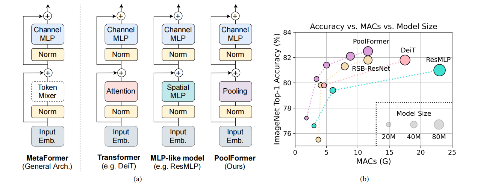
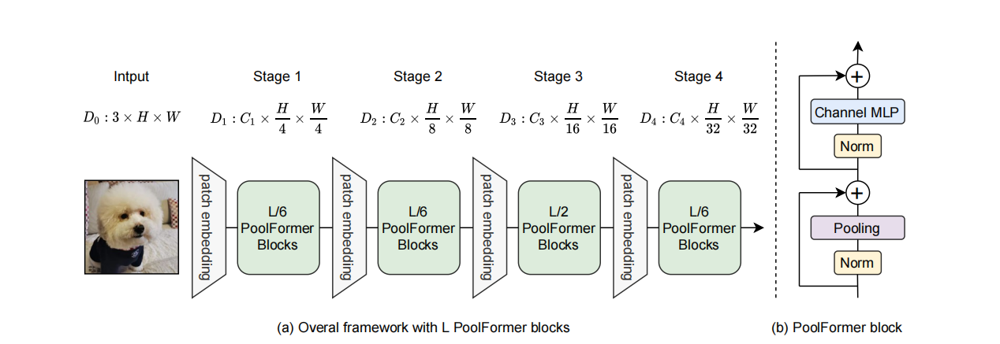

# PoolFormer
> [MetaFormer Is Actually What You Need for Vision](https://arxiv.org/pdf/2111.11418v3.pdf)

## Introduction

Instead of designing complicated token mixer to achieve SOTA performance, the target of this work is to demonstrate the competence of Transformer models largely stem from the general architecture MetaFormer. Pooling/PoolFormer are just the tools to support our claim.


Figure 1: MetaFormer and performance of MetaFormer-based models on ImageNet-1K validation set. We argue that the competence of Transformer/MLP-like models primarily stem from the general architecture MetaFormer instead of the equipped specific token mixers. To demonstrate this, we exploit an embarrassingly simple non-parametric operator, pooling, to conduct extremely basic token mixing. Surprisingly, the resulted model PoolFormer consistently outperforms the DeiT and ResMLP as shown in (b), which well supports that MetaFormer is actually what we need to achieve competitive performance. RSB-ResNet in (b) means the results are from “ResNet Strikes Back” where ResNet is trained with improved training procedure for 300 epochs.


Figure 2: (a) The overall framework of PoolFormer. (b) The architecture of PoolFormer block. Compared with Transformer block, it replaces attention with an extremely simple non-parametric operator, pooling, to conduct only basic token mixing.


## Results

| Model           | Context   |  Top-1 (%)  | Top-5 (%)  |  Params (M)    | Train T. | Infer T. |  Download | Config | Log |
|-----------------|-----------|-------------|------------|----------------|----------|----------|-----------|--------|-----|
| poolformer_s12  | D910x8    | 77.094      |   93.394   |  12           | 396.24s/epoch | 19.9ms/step | [model]() | [cfg]() | [log]() |


#### Notes

- All models are trained on ImageNet-1K training set and the top-1 accuracy is reported on the validatoin set.
- Context: GPU_TYPE x pieces - G/F, G - graph mode, F - pynative mode with ms function.  

## Quick Start

### Preparation

#### Installation
Please refer to the [installation instruction](https://github.com/mindspore-ecosystem/mindcv#installation) in MindCV.

#### Dataset Preparation
Please download the [ImageNet-1K](https://www.image-net.org/download.php) dataset for model training and validation.

### Training

- **Hyper-parameters.** The hyper-parameter configurations for producing the reported results are stored in the yaml files in `mindcv/configs/poolformer` folder. For example, to train with one of these configurations, you can run:

  ```shell
  # train poolformer_s12 on 8 Ascends
  mpirun -n 8 python train.py -c ./configs/poolformer/poolformer_s12.yaml --data_dir=/path/to/data
  ```
  
  Note that the number of GPUs/Ascends and batch size will influence the training results. To reproduce the training result at most, it is recommended to use the **same number of GPUs/Ascneds** with the same batch size.


Detailed adjustable parameters and their default value can be seen in [config.py](../../config.py).

### Validation

- To validate the trained model, you can use `validate.py`. Here is an example for densenet121 to verify the accuracy of
  pretrained weights.

  ```shell
  python validate.py --model=poolformer_s12 --data_dir=imagenet_dir --val_split=val --ckpt_path
  ```


### Deployment (optional)

Please refer to the deployment tutorial in MindCV.
