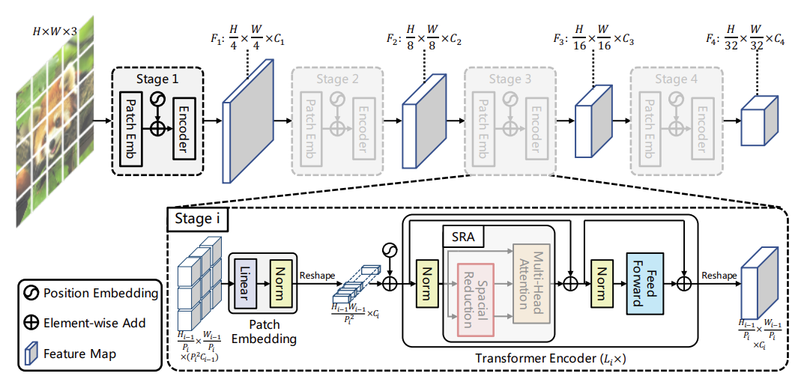

# Pyramid Vision Transformer

***
> [Pyramid Vision Transformer: A Versatile Backbone for Dense Prediction without Convolutions](https://arxiv.org/abs/2102.12122)

## 模型简介

***
PVT是一种无需卷积操作的用于密集预测的通用主干网络。PVT在Transformer中引入金字塔结构，以便为密集的预测任务生成多尺度特征图。PVT使用逐步缩小策略，通过块嵌入层来控制特征图的规模，并提出了一个SRA层(spatial-reduction attention, 空间缩减注意)来替代编码器中传统的多头注意力层，大大减少了计算/内存开销。


## 性能指标

***

| Model           |  Top-1 (%)  | Train T. | Infer T. |  Download | Config | Log |  
|-----------------|-----------|-------|-------|------------|-------|--------|
| PVT_tiny     |74.92 |  433s/epoch  | 16ms/step | [model]() | [cfg]()    | [log]() |
| PVT_small     | 79.66  |538s/epoch |30ms/step | [model]() | [cfg]()    | [log]() |
| PVT_medium    |81.82  |766s/epoch |47ms/step | [model]() | [cfg]()    | [log]() |
| PVT_large    |81.75  |1074s/epoch |67ms/step | [model]() | [cfg]()    | [log]() |

## 示例

***

### 训练

- 下面是使用预设的yaml配置文件启动训练的示例.

> [configs文件夹](../../configs)中列出了mindcv套件所包含的模型的各个规格的yaml配置文件(在ImageNet数据集上训练和验证的配置)。

  ```shell
  export CUDA_VISIBLE_DEVICES=0,1,2,3,4,5,6,7
  mpirun -n 8 python train.py -c configs/pvt/pvt_tiny_ascend.yaml --data_dir /path/to/imagenet
  ```

- 下面是使用在ImageNet上预训练的pvt_tiny模型和Momentum优化器在CIFAR10数据集上进行微调的示例。

  ```shell
  python train.py --model=pvt_tiny --pretrained --opt=momentum --lr=0.001 dataset=cifar10 --num_classes=10 --dataset_download
  ```

详细的可调参数及其默认值可以在[config.py](../../config.py)中查看。

### 验证

- 下面是使用`validate.py`文件验证pvt_tiny的预训练模型的精度的示例。

  ```shell
  python validate.py --model=pvt_tiny --dataset=imagenet --val_split=val --pretrained
  ```

- 下面是使用`validate.py`文件验证pvt_tiny的自定义参数文件的精度的示例。

  ```shell
  python validate.py --model=pvt_tiny --dataset=imagenet --val_split=val --ckpt_path='./ckpt/pvt-tiny-best.ckpt'
  ```
