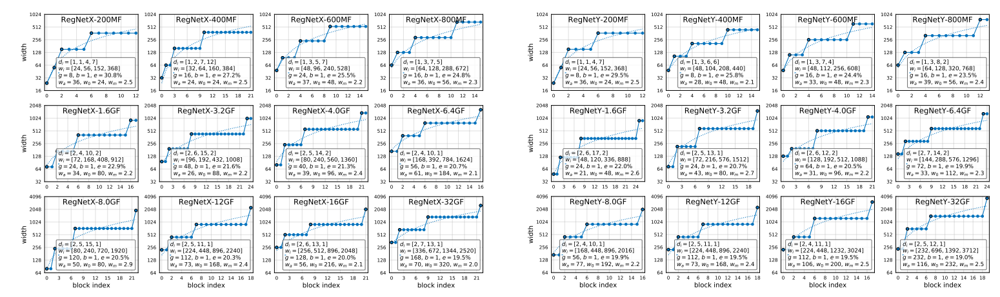

# RegNet
> [Designing Network Design Spaces](https://arxiv.org/pdf/2003.13678.pdf)

## 模型简介
***

在这项工作中，我们提出了一种新的网络设计范式，它结合了人工设计和NAS的优点。我们不是专注于设计单个网络实例，而是设计参数化网络总体的设计空间。就像手工设计一样，我们的目标是可解释性，并发现描述网络的通用设计原则，这些原则简单、工作良好，并且可以跨设置进行推广。与NAS一样，我们的目标是利用半自动化的过程来帮助实现这些目标。我们采用的一般策略是逐步设计初始的、相对不受限制的设计空间的简化版本，同时保持或提高其质量。整个过程类似于手工设计，提升到群体水平，并通过网络设计空间的分布估计进行指导。作为这个范例的测试平台，我们的重点是在假设包括VGG、ResNet和ResNeXt在内的标准模型族的情况下探索网络结构(例如宽度、深度、组等)。我们从一个相对不受约束的设计空间开始，我们称之为AnyNet(例如，宽度和深度在不同阶段自由变化)，到达一个由简单的“规则”网络组成的低维设计空间，我们称之为RegNet。RegNet设计空间的核心很简单:stage的宽度和深度由量化的线性函数决定。与AnyNet相比，RegNet设计空间的模型更简单，更容易解释，好模型的集中度更高。



## 性能指标
***

| Model           | Context   |  Top-1 (%)  |  Params (M)    | Train T. | Infer T. |  Download | Config | Log |
|-----------------|-----------|-------|------------|-------|--------|---|--------|--------------|
| RegNetX-800MF | D910x8-G | 76.09     | 7.3       | 115s/epoch | 1.8ms/step | [model]() | [cfg]() | [log]() |

#### 备注

- All models are trained on ImageNet-1K training set and the top-1 accuracy is reported on the validatoin set.
- Context: GPU_TYPE x pieces - G/F, G - graph mode, F - pynative mode with ms function.  

## 示例
***
### 准备步骤

#### 安装仓库
请参考MindCV中的 [安装指南](https://github.com/mindspore-ecosystem/mindcv#installation)。

#### 准备数据集
请下载 [ImageNet-1K](https://www.image-net.org/download.php) 数据集以用作模型训练和验证。

### 模型训练

- 在configs文件夹中列出了在ImageNet上为不同模型产生竞争性结果的yaml配置文件。使用预设的yaml配置进行训练。

  ```shell
  python train.py --model=regnet_x_800mf --config=configs/regnet/regnet_x_800mf_ascend.yaml
  ```

### 模型验证

- 要验证训练过的模型，可以使用 `validate.py`。下面是对regnetx800mf进行验证的一个示例，用于验证pretrained权重的准确性。

  ```shell
  python validate.py --model=regnet_x_800mf --dataset=imagenet --val_split=val --pretrained
  ```

- 要验证模型权重，可以使用 `validate.py`。下面是对regnetx800mf权重进行验证的一个示例。

  ```shell
  python validate.py --model=regnet_x_800mf --dataset=imagenet --val_split=val --ckpt_path='./ckpt/regnet_x_800mf-best.ckpt'
  ```

### 部署 (可选)

请参考MindCV的部署教程。


