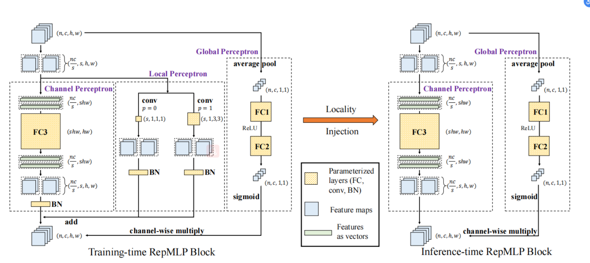

# RepMLPNet
> [RepMLPNet: Hierarchical Vision MLP with Re-parameterized Locality](https://arxiv.org/pdf/2112.11081v2.pdf)

## Introduction
***

Accepted to CVPR-2022!

The latest version: https://openaccess.thecvf.com/content/CVPR2022/papers/Ding_RepMLPNet_Hierarchical_Vision_MLP_With_Re-Parameterized_Locality_CVPR_2022_paper.pdf

Compared to the old version, we no longer use RepMLP Block as a plug-in component in traditional ConvNets. Instead, we build an MLP architecture with RepMLP Block with a hierarchical design. RepMLPNet shows favorable performance, compared to the other vision MLP models including MLP-Mixer, ResMLP, gMLP, S2-MLP, etc.

Of course, you may also use it in your model as a building block.

The overlap between the two versions is the Structural Re-parameterization method (Localtiy Injection) that equivalently merges conv into FC. The architectural designs presented in the latest version significantly differ from the old version (ResNet-50 + RepMLP).

## Results
model is under testing, comming soon

