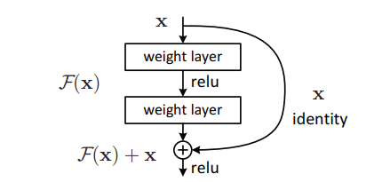

# ResNet
> [Deep Residual Learning for Image Recognition](https://arxiv.org/pdf/1512.03385.pdf)

## Introduction
***

Deeper neural networks are more difficult to train. Resnet is a residual learning framework to ease the training of networks that are substantially deeper than those used previously, which is explicitly reformulated that the layers are learning residual functions with reference to the layer inputs, instead of learning unreferenced functions. Lots of comprehensive empirical evidence showing that these residual networks are easier to optimize, and can gain accuracy from considerably increased depth.



## Results
***

| Model           | Context   |  Top-1 (%)  | Top-5 (%)  |  Params (M)    | Train T. | Infer T. |  Download | Config | Log |
|-----------------|-----------|-------|-------|------------|-------|--------|---|--------|--------------|
| ResNet18 | D910x8-G | 70.10 | 89.58 | 11.70 | 118s/epoch |  | [model]() | [cfg]() | [log]() |
| ResNet34 | D910x8-G | 74.19 | 91.76 | 21.81 | 122s/epoch |  | [model]() | [cfg]() | [log]() |
| ResNet50 | D910x8-G | 76.78 | 93.42 | 25.61 | 213s/epoch |  | [model]() | [cfg]() | [log]() |
| ResNet101 | D910x8-G | 78.06 | 94.15 | 44.65 | 327s/epoch |  | [model]() | [cfg]() | [log]() |
| ResNet152 | D910x8-G | 78.37 | 94.09 | 60.34 | 456s/epoch |  | [model]() | [cfg]() | [log]() |

#### Notes

- All models are trained on ImageNet-1K training set and the top-1 accuracy is reported on the validatoin set.
- Context: GPU_TYPE x pieces - G/F, G - graph mode, F - pynative mode with ms function.  

## Quick Start
***
### Preparation

#### Installation
Please refer to the [installation instruction](https://github.com/mindspore-ecosystem/mindcv#installation) in MindCV.

#### Dataset Preparation
Please download the [ImageNet-1K](https://www.image-net.org/download.php) dataset for model training and validation.

### Training

- **Hyper-parameters.** The hyper-parameter configurations for producing the reported results are stored in the yaml files in `mindcv/configs/resnet` folder. For example, to train with one of these configurations, you can run:

  ```shell
  # train resnet18 on 8 GPUs
  export CUDA_VISIBLE_DEVICES=0,1,2,3,4,5,6,7
  mpirun -n 8 python train.py -c configs/resnet/resnet_18_gpu.yaml --data_dir /path/to/imagenet
  ```
  
  Note that the number of GPUs/Ascends and batch size will influence the training results. To reproduce the training result at most, it is recommended to use the **same number of GPUs/Ascneds** with the same batch size.

- **Finetuning.** Here is an example for finetuning a pretrained resnet18 on CIFAR10 dataset using Momentum optimizer.

  ```shell
  python train.py --model=resnet18 --pretrained --opt=momentum --lr=0.001 dataset=cifar10 --num_classes=10 --dataset_download
  ```

Detailed adjustable parameters and their default value can be seen in [config.py](../../config.py).

### Validation

- To validate the trained model, you can use `validate.py`. Here is an example for resnet18 to verify the accuracy of
  pretrained weights.

  ```shell
  python validate.py --model=resnet18 --dataset=imagenet --val_split=val --pretrained
  ```

- To validate the model, you can use `validate.py`. Here is an example for resnet18 to verify the accuracy of your
  training.

  ```shell
  python validate.py --model=resnet18 --dataset=imagenet --val_split=val --ckpt_path='./ckpt/resnet18-best.ckpt'
  ```

### Deployment (optional)

Please refer to the deployment tutorial in MindCV.


