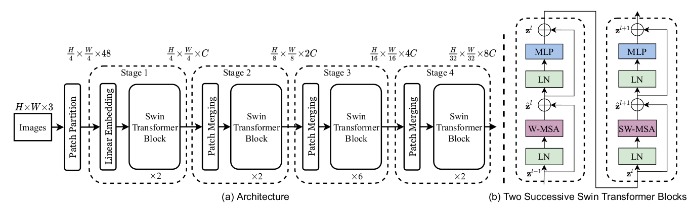

# Swin Transformer
> For more details, please refer to: [Swin Transformer: Hierarchical Vision Transformer using Shifted Windows](https://arxiv.org/abs/2103.14030)

## Introduction

<div align=center>


</div>
 
The key idea of Swin transformer is that the features in shifted window go through transformer module rather than the whole feature map. Besides that, Swin transformer extracts features of different levels. Additionally, compared with Vision Transformer (ViT), the resolution of Swin Transformer in different stages varies so that features with different sizes could be learned. The above figure shows the model architecture of Swin transformer. Swin transformer could achieve better model performance with smaller model parameters and less computation cost on [ImageNet-1K dataset](https://www.image-net.org/download.php) compared with ViT and ResNet.

## Results

<div align=center>

| Model           | Context   |  Top-1 (%)  | Top-5 (%)  |  Params (M)    | Train T. | Infer T. |  Download | Config | Log |
|-----------------|-----------|-------|-------|------------|-------|--------|---|--------|--------------|
| Swin-T | D910x8-G | -     | -     | -       | -s/epoch | -ms/step | [model]() | [cfg]() | [log]() |
| Swin-S | D910x8-G | -     | -     | -       | -s/epoch | -ms/step | [model]() | [cfg]() | [log]() |
| Swin-B | D910x8-G | -     | -     | -       | -s/epoch | -ms/step | [model]() | [cfg]() | [log]() |
| Swin-L | D910x8-G | -     | -     | -       | -s/epoch | -ms/step | [model]() | [cfg]() | [log]() |
</div>


#### Notes

- All models are trained on ImageNet-1K training set and the top-1 accuracy is reported on the validatoin set.
- Context: GPU_TYPE x pieces - G/F, G - graph mode, F - pynative mode with ms function.  

## Quick Start
<details>
<summary>Preparation</summary>

#### Installation
Please refer to the [installation instruction](https://github.com/mindspore-ecosystem/mindcv#installation) in MindCV.

#### Dataset Preparation
Please download the [ImageNet-1K](https://www.image-net.org/download.php) dataset for model training and validation.
</details>

<details>
<summary>Training</summary>

- **Hyper-parameters.** The hyper-parameter configurations for producing the reported results are stored in the yaml files in `mindcv/configs/swintransformer` folder. For example, to train with one of these configurations, you can run:

  ```shell
  # train Swin-T on 8 GPUs
  mpirun -n 8 python train.py --config path/to/swintransformer/yaml/file --data_dir /path/to/imagenet
  ```

  Note that the number of GPUs/Ascends and batch size will influence the training results. To reproduce the training result at most, it is recommended to use the **same number of GPUs/Ascends** with the same batch size.

Detailed adjustable parameters and their default value can be seen in [config.py](../../config.py).
</details>

<details>
<summary>Validation</summary>

- To validate the model, you can use `validate.py`. Here is an example for Swin-T to verify the accuracy of your training.

  ```shell
  python validate.py --config path/to/swintransformer/yaml/file --data_dir /path/to/imagenet --ckpt_path /path/to/swintransformer/file.ckpt
  ```
</details>

<details>
<summary>Deployment (optional)</summary>

Please refer to the deployment tutorial in MindCV.
</details>


