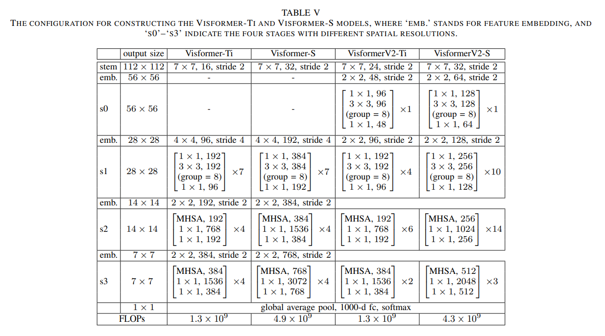

# Visformer
> [Visformer: The Vision-friendly Transformer](https://arxiv.org/pdf/2104.12533.pdf)

## Introduction
***

The past few years have witnessed the rapid development of applying the Transformer module to vision problems. While some
researchers have demonstrated that Transformer based models enjoy a favorable ability of fitting data, there are still 
growing number of evidences showing that these models suffer over-fitting especially when the training data is limited. 
This paper offers an empirical study by performing step-bystep operations to gradually transit a Transformer-based model
to a convolution-based model. The results we obtain during the transition process deliver useful messages for improving 
visual recognition. Based on these observations, we propose a new architecture named Visformer, which is abbreviated from
the ‘Vision-friendly Transformer’.



## Results
***
## ImageNet-1k

|Model|Context| Top1/Top5 | Params(M) |Ckpt|Config|
| :------:| :------: | :-------: | :-------: |:-----: |:-----: |
|visformer_tiny| D910x8-G |78.28/94.15|10|[ckpt](https://download.mindspore.cn/toolkits/mindcv/visformer/visformer_tiny.ckpt)|[yaml](https://github.com/mindspore-lab/mindcv/blob/main/configs/visformer/visformer_tiny_ascend.yaml)|
visformer_tiny_v2 | D910x8-G |78.82/94.41 |9| coming | [yaml](https://github.com/mindspore-lab/mindcv/blob/main/configs/visformer/visformer_tiny_v2_ascend.yaml) | 
visformer_small | D910x8-G |   81.73/95.88   | 40    | [ckpt](https://download.mindspore.cn/toolkits/mindcv/visformer/visformer_small.ckpt) | [yaml](https://github.com/mindspore-lab/mindcv/blob/main/configs/visformer/visformer_small_ascend.yaml) | 
| visformer_small_v2 | D910x8-G |   82.17/95.90   | 23    | [ckpt](https://download.mindspore.cn/toolkits/mindcv/visformer/visformer_small_v2.ckpt) | [yaml](https://github.com/mindspore-lab/mindcv/blob/main/configs/visformer/visformer_small_v2_ascend.yaml) | 

#### Notes
- Context: D910 -> HUAWEI Ascend 910 |  x 8 ->  using 8 NPUs | G -> MindSpore graph model ; F -> MindSpore pynative mode.

## Quick Start
***
### Preparation

#### Installation
Please refer to the [installation instruction](https://github.com/mindspore-lab/mindcv#installation) in MindCV.

#### Dataset Preparation
Please download the [ImageNet-1K](https://www.image-net.org/download.php) dataset for model training and validation.

### Training

- **Hyper-parameters.** The hyper-parameter configurations for producing the reported results are stored in the yaml 
  files in `mindcv/configs/visformer` folder. For example, to train with one of these configurations, you can run:

  ```shell
  # train visformer on 8 GPUs
  mpirun -n 8 python train.py -c configs/visformer/visformer_tiny_ascend.yaml --data_dir /path/to/imagenet
  ```

  Note that the number of GPUs/Ascends and batch size will influence the training results. To reproduce the training result at most, it is recommended to use the **same number of GPUs/NPUs** with the same batch size.

Detailed adjustable parameters and their default value can be seen in [config.py](../../config.py).

### Validation

- To validate the model, you can use `validate.py`. Here is an example for visformer_tiny to verify the accuracy of your
  training.

  ```shell
  python validate.py -c configs/visformer/visformer_tiny_ascend.yaml --data_dir /path/to/imagenet --ckpt_path /path/to/visformer_tiny.ckpt
  ```


