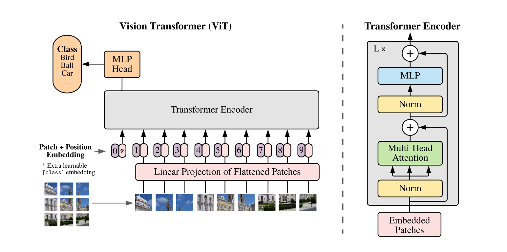

# ViT

> [[2010.11929\] An Image is Worth 16x16 Words: Transformers for Image Recognition at Scale (arxiv.org)](https://arxiv.org/abs/2010.11929)

## Introduction

---

While the Transformer architecture has become the de-facto standard for natural language processing tasks, its applications to computer vision remain limited. In vision, attention is either applied in conjunction with convolutional networks, or used to replace certain components of convolutional networks while keeping their overall structure in place. We show that this reliance on CNNs is not necessary and a pure transformer applied directly to sequences of image patches can perform very well on image classification tasks. When pre-trained on large amounts of data and transferred to multiple mid-sized or small image recognition benchmarks (ImageNet, CIFAR-100, VTAB, etc.), Vision Transformer (ViT) attains excellent results compared to state-of-the-art convolutional networks while requiring substantially fewer computational resources to train.



## Results

---

|    Model     | Context  | Top-1 (%) | Top-5 (%) | Params(M) |  Train T.  |  Infer T.   |                           Download                           |                            Config                            |                             Log                              |
| :----------: | :------: | :-------: | :-------: | :-------: | :--------: | :---------: | :----------------------------------------------------------: | :----------------------------------------------------------: | :----------------------------------------------------------: |
| vit_b_32_224 | D910x8-G |   75.86   |   92.08   |    86     | 619ms/step | 11.6ms/step | [model](https://github.com/mindspore-lab/mindcv/blob/main/configs/vit) | [cfg](https://github.com/mindspore-lab/mindcv/blob/main/configs/vit) | [log](https://github.com/mindspore-lab/mindcv/blob/main/configs/vit) |
| vit_l_16_224 | D910x8-G |   76.34   |   92.79   |    307    | 632ms/step | 5.37ms/step | [model](https://github.com/mindspore-lab/mindcv/blob/main/configs/vit) | [cfg](https://github.com/mindspore-lab/mindcv/blob/main/configs/vit) | [log](https://github.com/mindspore-lab/mindcv/blob/main/configs/vit) |
| vit_l_32_224 | D910x8-G |   73.71   |   90.92   |    307    | 534ms/step | 6.22ms/step | [model](https://github.com/mindspore-lab/mindcv/blob/main/configs/vit) | [cfg](https://github.com/mindspore-lab/mindcv/blob/main/configs/vit) | [log](https://github.com/mindspore-lab/mindcv/blob/main/configs/vit) |

#### Notes

- All models are trained on ImageNet-1K training set and the top-1 accuracy is reported on the validatoin set.
- Context: GPU_TYPE x pieces - G/F, G - graph mode, F - pynative mode with ms function.

## Quick Start

---

### Preparation

#### Installation

Please refer to the [installation instruction](https://github.com/mindspore-ecosystem/mindcv#installation) in MindCV.

#### Dataset Preparation

Please download the [ImageNet-1K](https://www.image-net.org/download.php) dataset for model training and validation.

### Training

- **Hyper-parameters.** The hyper-parameter configurations for producing the reported results are stored in the yaml files in `mindcv/configs/vit` folder. For example, to train with one of these configurations, you can run:

  ```
  # train vit on 8 NPUs
  mpirun -n 8 python train.py -c configs/vit/vit_b32_224_ascend.yaml --data_dir /path/to/imagenet
  ```

  Note that the number of GPUs/Ascends and batch size will influence the training results. To reproduce the training result at most, it is recommended to use the **same number of GPUs/Ascneds** with the same batch size.

Detailed adjustable parameters and their default value can be seen in [config.py](https://github.com/mindspore-lab/mindcv/blob/main/config.py)

### Validation

- To validate the trained model, you can use `validate.py`. Here is an example for vit_b_32 to verify the accuracy of pretrained weights.

  ```
  python validate.py -c configs/vit/vit_b32_224_ascend.yaml --data_dir /path/to/imagenet --ckpt_path /path/to/ckpt
  ```

### Deployment (optional)

Please refer to the deployment tutorial in MindCV.
