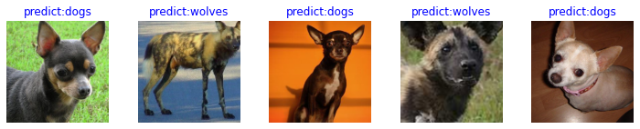

# Vision Transformer Image Classification Optimization

[](https://download.mindspore.cn/toolkits/mindcv/tutorials/optimize_vit.ipynb)
&emsp;

In this tutorial, you will learn how to use the MindCV to optimize the performance of vit in image classification task
to solve the problem of using vit models for image classification on custom datasets. In the deep learning task, we
often encounter the problem of insufficient training data, and it is difficult to directly train the whole network to
achieve the desired accuracy. A good practice is to use a pre-trained model on a large dataset (closer to task data) and
then use the model to initialize the network's weights or apply it to a specific task as a fixed feature extraction.

This tutorial will use the `vit_b_32_224` pretrained on ImageNet as an example to introduce the strategy of finetuning
the vit model through the whole network to solve the problem of wolf and dog image classification in the case of small
samples.

## Introduction to Vision Transformer (ViT)

In recent years, the development of models based on Self-Attention structure, especially the Transformer model, has
greatly promoted the development of NLP. Due to its computational efficiency and scalability, Transformers has been able
to train models with unprecedented scales of over 100B parameters.

ViT is the fusion of natural language processing and computer vision. In the case of not relying on convolution
operation, the image classification task can still achieve good results.

### Model Structure

The main structure of the ViT model is based on the Encoder part of the Transformer model. (The sequence of some
structures is adjusted. For example, the position of Normalization is different from that of the standard Transformer.)
The Fig.1 is as follows:


<center> Fig.1 </center>

### Model Characteristics

The ViT model is mainly used in the field of image classification. Therefore, compared with the traditional Transformer,
the model structure has the following characteristics:

1. After the original image of the data set is divided into multiple patches, the two-dimensional patch (not considering
   channel) is converted into one-dimensional vector, and then the category vector and position vector are added as the
   model input.
2. The `Block` structure of backbone is based on the Encoder structure of Transformer, but the position of Normalization
   is adjusted, and the most important structure is still Multi-head Attention.
3. The backbone is connected to a fully connected layer after the Blocks stack, and the output of the category vector is
   taken as input and used for classification. Generally, the final full connection layer is called Head, and the
   Transformer Encoder part is called Backbone.

We will explain the task of classifying wolf and dog images based on ViT in detail.

## Environment Preparation and Data Reading

Before you begin to learn this tutorial, make sure that the Python environment is existed
and [MindSPore](https://mindspore.cn/install)
and [MindCV](https://github.com/mindspore-lab/mindcv/blob/main/README.md#Installation) are installed properly.

## Data loading and processing

Import related modules, define related hyperparameters, and load datasets. The MindCV has APIs that can be directly
invoked to complete these operations.

First, we need to download the dataset of this case. The dataset will be automatically downloaded and decompressed in
the first code cell. Ensure that the dataset path is as follows:

```text
data/
└── Canidae
    ├── train
    │   ├── dogs
    │   └── wolves
    └── val
        ├── dogs
        └── wolves
```

```python
import sys

sys.path.append('../')

from mindcv.utils.download import DownLoad
import os

dataset_url = "https://mindspore-website.obs.cn-north-4.myhuaweicloud.com/notebook/datasets/intermediate/Canidae_data.zip"
root_dir = "./"

if not os.path.exists(os.path.join(root_dir, 'data/Canidae')):
    DownLoad().download_and_extract_archive(dataset_url, root_dir)
```

```text
11882496B [00:00, 22486394.82B/s]
```

By calling `create_dataset` function in `mindcv.data` module, we can easily load preset datasets as well as custom
datasets.

- When the parameter `name` is set as blank, it specifies a custom dataset. (Default)
- When the parameter `name` is set as the name of standard dataset(e.g. `MNIST`, `CIFAR10`), it specifies a preset
  dataset.

As the same time, we need to set the path of the dataset `data_dir` and the name data split `split` (e.g. train, val) to
load a corresponding training set or evaluation set.

```python
from mindcv.data import create_dataset, create_transforms, create_loader

num_workers = 8

# Dataset Directory Path
data_dir = "data/Canidae"

# Load Custom Dataset
dataset_train = create_dataset(root=data_dir, split='train', num_parallel_workers=num_workers)
```

First, we call `create_transforms` function to define the preset data enhancement operation. In this task, we
specify `dataset_name` as `ImageNet`, because the wolf-dog image dataset and original ImageNet dataset are consistent.
We can use preset `ImageNet` data enhancement operations directly. `create_transforms` also supports a variety of custom
enhancement operations, as well as automatic enhancement operations. For more details, please see the API description.

We'll pass in the list of the `create_loader()`, and specify `batch_size` and other parameters, you can prepare the
training and verification data, and return `Dataset`, which is used as the input of the model.

```python
# Define and load data processing and enhancement operations
trans_train = create_transforms(dataset_name='ImageNet', is_training=True)

loader_train = create_loader(
    dataset=dataset_train,
    batch_size=16,
    is_training=True,
    num_classes=2,
    transform=trans_train,
    num_parallel_workers=num_workers,
)
```

## Model Analysis

The internal structure of the ViT model will be analyzed in detail by code.

### Basic Principles of Transformer

The Transformer model is derived from a 2017 paper[2]. The encoder-decoder architecture based on the Attention
mechanism proposed in the paper has achieved great success in the field of natural language processing. The model
structure is shown in the following figure:


The main structure is composed of multiple encoders and decoders. The detailed structure of the encoders and decoders is
shown in Fig.2.


<center> Fig.2. </center>

Encoder and Decoder are composed of many structures, such as Multi-Head Attention layer, Feed Forward layer,
Normalization layer, and residual connection. (Residual Connection, "Add" in the figure).

The most important structure is the Multi-Head Attention structure, which is based on the Self-Attention mechanism and
is a parallel composition of multiple Self-Attentions. So, understanding Self-Attention captures the core of
Transformer.

#### Attention module

Here's an explanation of Self-Attention, which is at the heart of learning a weight for each word of the input vector.
By giving a task-related query vector Query vector, the similarity or correlation between Query and each Key is
calculated to obtain the attention distribution, that is, the weight coefficient of the value corresponding to each Key
is obtained, and then the weighted summation of the Value is performed to obtain the final attention value.

In Self-Attention:

1. The initial input vector is first mapped to three vectors: Q (Query), K (Key), and V (Value) through the Embedding
   layer. Because the operation is parallel, the code is mapped to a vector of dim x 3 and then segmented. In other
   words, If your input vector is a vector sequence ($x_1$, $x_2$, $x_3$), where $x_1$, $x_2$, and $x_3$ are all
   one-dimensional vectors, then each one-dimensional vector will be mapped to three vectors Q, K, and V through the
   Embedding layer. The difference is that the Embedding matrix is different, and the matrix parameters are also
   obtained through learning. Here, we can think that the three matrices Q, K, and V are a means of discovering the
   correlation information between vectors and need to be obtained through learning. The reason why the three matrices
   Q, K, and V are Q, K, and V is mainly because two vector points are multiplied to obtain the weight, and another
   vector is required to carry the weight-to-weight result. So, at least three matrices are required.

$$ \begin{cases} q_i = W_q \cdot x_i & \\ k_i = W_k \cdot x_i,\hspace{1em} &i = 1,2,3 \ldots \\ v_i = W_v \cdot x_i &
\end{cases} \tag{1} $$


2. The self-attention mechanism is mainly embodied in its Q, K and V all come from itself, that is, the process is to
   extract the relations and features of different order vectors of input, and finally through the closeness of
   relations between different order vectors. (Result of Q and K product after Softmax) to show it. After Q, K, and V
   are obtained, the weights between vectors need to be obtained, and Q and K need to be multiplied by the square root
   of the dimension, and Softmax processing is performed on the results of all vectors. We obtain the weights of the
   relationship between vectors through the operation of formula (2).

$$ \begin{cases} a_{1,1} = q_1 \cdot k_1 / \sqrt d \\ a_{1,2} = q_1 \cdot k_2 / \sqrt d \\ a_{1,3} = q_1 \cdot k_3 /
\sqrt d \end{cases} \tag{2} $$


$$ Softmax: \hat a_{1,i} = exp(a_{1,i}) / \sum_j exp(a_{1,j}),\hspace{1em} j = 1,2,3 \ldots \tag{3}$$


3. The final output is obtained by weight sum of the vectors after mapping V and Q. K is obtained by weight sum of the
   Softmax result. This process can be understood as global self-attention representation. Each group of Q, K, and V has
   a V output at the end. This is the final result obtained by Self-Attention. It is the result obtained after the
   weights of the current vector are combined with other vectors.

$$ b_1 = \sum_i \hat a_{1,i}v_i,\hspace{1em} i = 1,2,3... \tag{4} $$

The following figure shows the whole process of Self-Attention.


The multi-head attention mechanism divides the vector of self-attention processing into multiple headers for processing.
This can also be reflected in the code. This is also an aspect of parallel acceleration of the attention structure.

In conclusion, the multi-head attention mechanism maps the same query, key and value to different subspaces (Q_0, K_0)
of the original high-dimensional space (Q, K, V) while keeping the total parameter amount unchanged. The autoattention
is calculated in V_0), and then the attention information in different subspaces is merged.

Therefore, for the same input vector, multiple attention mechanisms can process it simultaneously, that is, use parallel
computation to accelerate the processing, and fully analyze and utilize the vector characteristics during processing.
The following figure shows the multi-head attention mechanism. The parallel capability of the multi-head attention
mechanism is mainly reflected in the following figure. $a_1$ and $a_2$ are obtained by partitioning the same vector.


The following is the Multi-Head Attention code in the Vision suite. The code clearly shows the process.

```python
from mindspore import nn, ops, Tensor


class Attention(nn.Cell):
    """
    Attention layer implementation, Rearrange Input -> B x N x hidden size.
    """

    def __init__(self,
                 dim: int,
                 num_heads: int = 8,
                 keep_prob: float = 1.0,
                 attention_keep_prob: float = 1.0):
        super().__init__()
        self.num_heads = num_heads
        head_dim = dim // num_heads
        self.scale = Tensor(head_dim ** -0.5)

        self.qkv = nn.Dense(dim, dim * 3)
        self.attn_drop = nn.Dropout(attention_keep_prob)
        self.out = nn.Dense(dim, dim)
        self.out_drop = nn.Dropout(keep_prob)

        self.mul = ops.Mul()
        self.reshape = ops.Reshape()
        self.transpose = ops.Transpose()
        self.unstack = ops.Unstack(axis=0)
        self.attn_matmul_v = ops.BatchMatMul()
        self.q_matmul_k = ops.BatchMatMul(transpose_b=True)
        self.softmax = nn.Softmax(axis=-1)

    def construct(self, x):
        """Attention construct."""
        b, n, c = x.shape
        qkv = self.qkv(x)
        qkv = self.reshape(qkv, (b, n, 3, self.num_heads, c // self.num_heads))
        qkv = self.transpose(qkv, (2, 0, 3, 1, 4))
        q, k, v = self.unstack(qkv)

        attn = self.q_matmul_k(q, k)
        attn = self.mul(attn, self.scale)
        attn = self.softmax(attn)
        attn = self.attn_drop(attn)

        out = self.attn_matmul_v(attn, v)
        out = self.transpose(out, (0, 2, 1, 3))
        out = self.reshape(out, (b, n, c))
        out = self.out(out)
        out = self.out_drop(out)

        return out
```

### Transformer Encoder

After understanding the Self-Attention structure, the Transformer basic structure can be formed by combining it with the
Feed Forward and Residual Connection structures. Then, the TransformerEncoder part of the ViT model can be constructed
by using Self-Attention. It is similar to the encoder part of a Transformer, as shown in Figure [1].


1. The basic structure in the ViT model is different from that in the standard Transformer. The normalization is placed
   before Self-Attention and Feed Forward. Other structures such as Residual Connection, Feed Forward, and Normalization
   are designed in the Transformer.

2. According to the Transformer structure picture, the model encoder is constructed by stacking multiple sub-encoders.
   This idea is still used in the ViT model. You can determine the number of stack layers by configuring the
   hyperparameter num_layers.

3. The structure of Residual Connection and Normalization ensures strong scalability of the model. (Residual Connection
   is used to ensure that information is not degraded after deep processing.) , Normalization and dropout can enhance
   the model generalization capability.

The structure of the transformer can be clearly seen from the following source code. Combining the TransformerEncoder
structure with a multi-layer perceptron (MLP), the backbone of the ViT model is formed.

```python
from typing import Optional

from mindspore import ops as P


class FeedForward(nn.Cell):
    """
    Feed Forward layer implementation.
    """

    def __init__(self,
                 in_features: int,
                 hidden_features: Optional[int] = None,
                 out_features: Optional[int] = None,
                 activation: nn.Cell = nn.GELU,
                 keep_prob: float = 1.0):
        super().__init__()
        out_features = out_features or in_features
        hidden_features = hidden_features or in_features
        self.dense1 = nn.Dense(in_features, hidden_features)
        self.activation = activation()
        self.dense2 = nn.Dense(hidden_features, out_features)
        self.dropout = nn.Dropout(keep_prob)

    def construct(self, x):
        """Feed Forward construct."""
        x = self.dense1(x)
        x = self.activation(x)
        x = self.dropout(x)
        x = self.dense2(x)
        x = self.dropout(x)

        return x


class ResidualCell(nn.Cell):
    """
    Cell which implements Residual function:
    $$output = x + f(x)$$
    """

    def __init__(self, cell):
        super().__init__()
        self.cell = cell

    def construct(self, x):
        """ResidualCell construct."""
        return self.cell(x) + x


class DropPath(nn.Cell):
    """
    Drop paths (Stochastic Depth) per sample (when applied in main path of residual blocks).
    """

    def __init__(self, keep_prob=None, seed=0):
        super().__init__()
        self.keep_prob = 1 - keep_prob
        seed = min(seed, 0)
        self.rand = P.UniformReal(seed=seed)
        self.shape = P.Shape()
        self.floor = P.Floor()

    def construct(self, x):
        if self.training:
            x_shape = self.shape(x)
            random_tensor = self.rand((x_shape[0], 1, 1))
            random_tensor = random_tensor + self.keep_prob
            random_tensor = self.floor(random_tensor)
            x = x / self.keep_prob
            x = x * random_tensor

        return x


class TransformerEncoder(nn.Cell):
    """
    TransformerEncoder implementation.
    """

    def __init__(self,
                 dim: int,
                 num_layers: int,
                 num_heads: int,
                 mlp_dim: int,
                 keep_prob: float = 1.,
                 attention_keep_prob: float = 1.0,
                 drop_path_keep_prob: float = 1.0,
                 activation: nn.Cell = nn.GELU,
                 norm: nn.Cell = nn.LayerNorm):
        super().__init__()
        drop_path_rate = 1 - drop_path_keep_prob
        dpr = [i.item() for i in np.linspace(0, drop_path_rate, num_layers)]
        attn_seeds = [np.random.randint(1024) for _ in range(num_layers)]
        mlp_seeds = [np.random.randint(1024) for _ in range(num_layers)]

        layers = []
        for i in range(num_layers):
            normalization1 = norm((dim,))
            normalization2 = norm((dim,))
            attention = Attention(dim=dim,
                                  num_heads=num_heads,
                                  keep_prob=keep_prob,
                                  attention_keep_prob=attention_keep_prob)

            feedforward = FeedForward(in_features=dim,
                                      hidden_features=mlp_dim,
                                      activation=activation,
                                      keep_prob=keep_prob)

            if drop_path_rate > 0:
                layers.append(
                    nn.SequentialCell([
                        ResidualCell(nn.SequentialCell([normalization1,
                                                        attention,
                                                        DropPath(dpr[i], attn_seeds[i])])),
                        ResidualCell(nn.SequentialCell([normalization2,
                                                        feedforward,
                                                        DropPath(dpr[i], mlp_seeds[i])]))]))
            else:
                layers.append(
                    nn.SequentialCell([
                        ResidualCell(nn.SequentialCell([normalization1,
                                                        attention])),
                        ResidualCell(nn.SequentialCell([normalization2,
                                                        feedforward]))
                    ])
                )
        self.layers = nn.SequentialCell(layers)

    def construct(self, x):
        """Transformer construct."""
        return self.layers(x)
```

### Inputs to ViT Models

The traditional Transformer structure is mainly used to process word vectors (Word Embedding or Word Vectors) in the
natural language field. The main difference between word vectors and traditional image data is that word vectors are
usually stacked as 1-dimensional vectors, while pictures are stacked as two-dimensional matrices. The multi-head
attention mechanism extracts the connections between word vectors, namely contextual semantics, when processing stacks
of one-dimensional word vectors, which makes Transformer very useful in the field of natural language processing. How to
transform the 2-dimensional image matrix with the 1-dimensional word vector becomes a small threshold for Transformer to
enter the image processing field.

In the ViT model:

1. The input image is divided into 16 x 16 patches on each channel. This step is completed by convolution operation. Of
   course, division can also be performed manually. However, the convolution operation can also achieve the purpose and
   data processing can be performed once. For example, if a 224 x 224 image is input, 16 x 16 patches are obtained after
   convolution processing, the size of each patch is 14 x 14.
2. Then, the matrix of each patch is stretched into a one-dimensional vector to obtain the effect of approximate word
   vector stacking. The patch 14 x 14 obtained in the previous step is converted to a vector with length 196.

This is the first step of the image input network. The code of patch Embedding is as follows:

```python
class PatchEmbedding(nn.Cell):
    """
    Path embedding layer for ViT. First rearrange b c (h p) (w p) -> b (h w) (p p c).
    """
    MIN_NUM_PATCHES = 4

    def __init__(self,
                 image_size: int = 224,
                 patch_size: int = 16,
                 embed_dim: int = 768,
                 input_channels: int = 3):
        super().__init__()
        self.image_size = image_size
        self.patch_size = patch_size
        self.num_patches = (image_size // patch_size) ** 2
        self.conv = nn.Conv2d(input_channels, embed_dim, kernel_size=patch_size, stride=patch_size, has_bias=True)
        self.reshape = ops.Reshape()
        self.transpose = ops.Transpose()

    def construct(self, x):
        """Path Embedding construct."""
        x = self.conv(x)
        b, c, h, w = x.shape
        x = self.reshape(x, (b, c, h * w))
        x = self.transpose(x, (0, 2, 1))

        return x
```

After the input image is divided into patches, the pos_embedding and class_embedding processes are performed.

1. The class_embedding mainly uses the idea of the BERT model for text classification. A category value is added before
   each word vector. Generally, the class_embedding is added to the first part of the vector. The 196-dimensional vector
   obtained in the previous step becomes 197-dimensional after class_embedding is added.
2. The added class_embedding is a parameter that can be learned. After continuous training of the network, the final
   output class is determined by the output of the first dimension of the output vector. Because the input is 16 x 16
   patches, the output is classified by 16 x 16 class_embedding.
3. pos_embedding is also a set of parameters that can be learned and added to the processed patch matrix.
4. Since pos_embedding is also a learnable parameter, its addition is similar to that of full-link networks and
   convolutional networks. This step is to create a trainable vector of length dimension 197 and add it to the
   class_embedding vector.

In fact, pos_embedding has four solutions. However, after the author's argument, only adding pos_embedding and not
adding pos_embedding has significant impact on the classification result, and whether pos_embedding is 1 or 2 dimensions
has little impact on the classification result. The 1-dimensional pos_embedding is also used. Because class_embedding is
added before pos_embedding, the dimension of pos_embedding is increased by 1 than the dimension after patch stretching.

In general, the ViT model takes advantage of the Transformer model in dealing with context semantics, and transforms the
image into a "variant word vector" and then processes it. The meaning of this transformation is that multiple patches
have spatial relations, which is similar to a "spatial semantics". Thus, a relatively good treatment effect is obtained.

### Build ViT as a Whole

The following code builds a complete ViT model.

```python
from mindspore.common.initializer import Normal


def init(init_type, shape, dtype, name, requires_grad):
    initial = initializer(init_type, shape, dtype).init_data()
    return Parameter(initial, name=name, requires_grad=requires_grad)


class ViT(nn.Cell):
    """
    Vision Transformer architecture implementation.
    """

    def __init__(self,
                 image_size: int = 224,
                 input_channels: int = 3,
                 patch_size: int = 16,
                 embed_dim: int = 768,
                 num_layers: int = 12,
                 num_heads: int = 12,
                 mlp_dim: int = 3072,
                 keep_prob: float = 1.0,
                 attention_keep_prob: float = 1.0,
                 drop_path_keep_prob: float = 1.0,
                 activation: nn.Cell = nn.GELU,
                 norm: Optional[nn.Cell] = nn.LayerNorm,
                 pool: str = 'cls') -> None:
        super().__init__()

        # Validator.check_string(pool, ["cls", "mean"], "pool type")
        # self.image_size = image_size

        self.patch_embedding = PatchEmbedding(image_size=image_size,
                                              patch_size=patch_size,
                                              embed_dim=embed_dim,
                                              input_channels=input_channels)
        num_patches = self.patch_embedding.num_patches

        if pool == "cls":
            self.cls_token = init(init_type=Normal(sigma=1.0),
                                  shape=(1, 1, embed_dim),
                                  dtype=ms.float32,
                                  name='cls',
                                  requires_grad=True)
            self.pos_embedding = init(init_type=Normal(sigma=1.0),
                                      shape=(1, num_patches + 1, embed_dim),
                                      dtype=ms.float32,
                                      name='pos_embedding',
                                      requires_grad=True)
            self.concat = ops.Concat(axis=1)
        else:
            self.pos_embedding = init(init_type=Normal(sigma=1.0),
                                      shape=(1, num_patches, embed_dim),
                                      dtype=ms.float32,
                                      name='pos_embedding',
                                      requires_grad=True)
            self.mean = ops.ReduceMean(keep_dims=False)

        self.pool = pool
        self.pos_dropout = nn.Dropout(keep_prob)
        self.norm = norm((embed_dim,))
        self.tile = ops.Tile()
        self.transformer = TransformerEncoder(dim=embed_dim,
                                              num_layers=num_layers,
                                              num_heads=num_heads,
                                              mlp_dim=mlp_dim,
                                              keep_prob=keep_prob,
                                              attention_keep_prob=attention_keep_prob,
                                              drop_path_keep_prob=drop_path_keep_prob,
                                              activation=activation,
                                              norm=norm)

    def construct(self, x):
        """ViT construct."""
        x = self.patch_embedding(x)

        if self.pool == "cls":
            cls_tokens = self.tile(self.cls_token, (x.shape[0], 1, 1))
            x = self.concat((cls_tokens, x))
            x += self.pos_embedding
        else:
            x += self.pos_embedding
        x = self.pos_dropout(x)
        x = self.transformer(x)
        x = self.norm(x)

        if self.pool == "cls":
            x = x[:, 0]
        else:
            x = self.mean(x, (1, 2))  # (1,) or (1, 2)
        return x
```

The overall flowchart is as follows:


## Overall Model Fine-tuning

### Pre-training model loading

We use `mindcv.models.vit` to define vit_b_32_224 network. When `pretrained` is set to True, the network weights can be
automatically downloaded. Since the pre-training model is classified for 1000 categories in the ImageNet dataset, we
set `num_classes=2`, the output of the classifier (that is, the last FC layer) of the ViT is adjusted to 2 dimensions.
In this case, only the pre-training weight of the backbone is loaded, while the classifier uses the initial value.

```python
import mindspore as ms
from mindspore.nn import LossBase
from mindspore import LossMonitor, TimeMonitor

from mindcv import create_model, create_loss, create_optimizer, create_scheduler

# Define Hyper-Parameters
epoch_size = 5
momentum = 0.9
step_size = loader_train.get_dataset_size()

# Load the model and the pre-training weight of the model.
network = create_model("vit_b_32_224", pretrained=True, num_classes=2)
```

### Model Training

Using the processed images of wolf-dog with tags to finetune ViT. Note that small learning rates should be used when
fine-tuning the overall model.

```python
# Define learning rate policies
lr = create_scheduler(steps_per_epoch=step_size,
                      scheduler="cosine_decay",
                      lr=0.00005,
                      warmup_epochs=0,
                      num_epochs=epoch_size,
                      decay_epochs=5)

# Define Optimizer
network_opt = create_optimizer(network.trainable_params(), opt="adam", lr=lr, momentum=momentum)

# define loss function
network_loss = create_loss(name="CE", reduction="mean", label_smoothing=0.1)

# initialize model
ascend_target = (ms.get_context("device_target") == "Ascend")

if ascend_target:
    model = ms.Model(network, loss_fn=network_loss, optimizer=network_opt, metrics={"acc"}, amp_level="O2")
else:
    model = ms.Model(network, loss_fn=network_loss, optimizer=network_opt, metrics={"acc"}, amp_level="O0")

# train model
model.train(epoch_size,
            loader_train,
            callbacks=[LossMonitor(15), TimeMonitor(15)],
            dataset_sink_mode=False)
```

### Model Evaluation

After the training is complete, we load a validation set to evaluate the accuracy of the model.

```python
dataset_val = create_dataset(root=data_dir, split='val', num_parallel_workers=num_workers)

trans_val = create_transforms(dataset_name='ImageNet', is_training=False)

loader_val = create_loader(
    dataset=dataset_val,
    batch_size=5,
    is_training=False,
    num_classes=2,
    transform=trans_val,
    num_parallel_workers=num_workers,
)

result = model.eval(loader_val)
print(result)
```

```text
{'acc': 1.0}
```

The results show that the precision of the model reaches 100% because we load the parameters of the pre-training model.
If the pre-training model parameters are not used, more epochs are required to train.

#### Visualized model inference results

Definition `visualize_mode` function, visual model prediction.

```python
import numpy as np
import matplotlib.pyplot as plt


def visualize_model(model, val_dl, num_classes=2):
    # Loading the data of the validation set for validation
    images, labels = next(val_dl.create_tuple_iterator())
    # Predictive Image Category
    output = model.predict(images)
    pred = np.argmax(output.asnumpy(), axis=1)
    # Displaying the image and the predicted value of the image
    images = images.asnumpy()
    labels = labels.asnumpy()
    class_name = {0: "dogs", 1: "wolves"}
    plt.figure(figsize=(15, 7))
    for i in range(len(labels)):
        plt.subplot(3, 6, i + 1)
        # If the prediction is correct, it is displayed in blue. If the prediction is incorrect, it is displayed in red.
        color = 'blue' if pred[i] == labels[i] else 'red'
        plt.title('predict:{}'.format(class_name[pred[i]]), color=color)
        picture_show = np.transpose(images[i], (1, 2, 0))
        mean = np.array([0.485, 0.456, 0.406])
        std = np.array([0.229, 0.224, 0.225])
        picture_show = std * picture_show + mean
        picture_show = np.clip(picture_show, 0, 1)
        plt.imshow(picture_show)
        plt.axis('off')

    plt.show()
```

```python
visualize_model(model, loader_val)
```



## Summary

This case completes the process of training, verification and inference of a ViT model on ImageNet data. The ViT
model structure and principle are explained. By learning this case, you can see the source code to help you
master key concepts such as Multi-Head Attention, TransformerEncoder, and pos_embedding. If you want to understand the
ViT model principles in detail, you are advised to read the source code in more depth.

## Citation

[1] Dosovitskiy, Alexey, et al. "An image is worth 16x16 words: Transformers for image recognition at scale." arXiv
preprint arXiv:2010.11929 (2020).

[2] Vaswani, Ashish, et al. "Attention is all you need."Advances in Neural Information Processing Systems. (2017).
